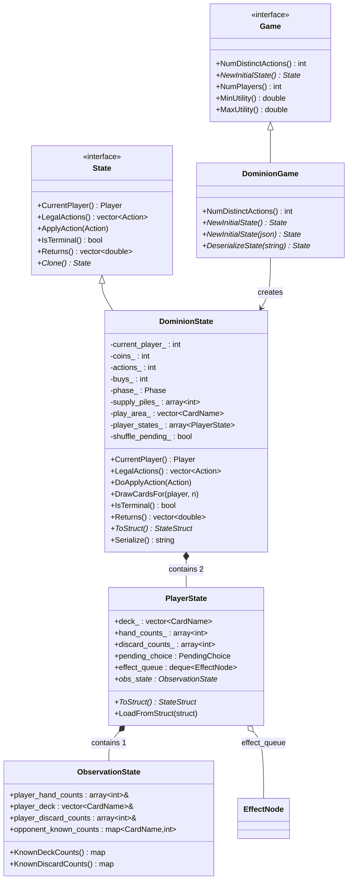
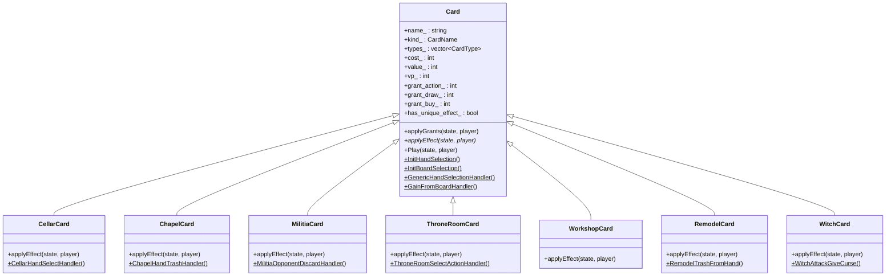
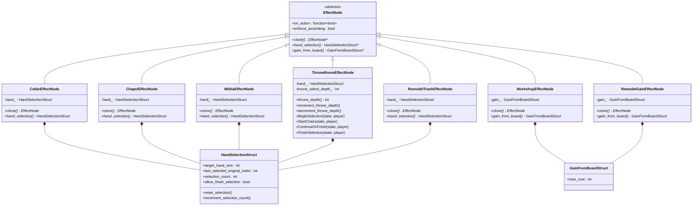
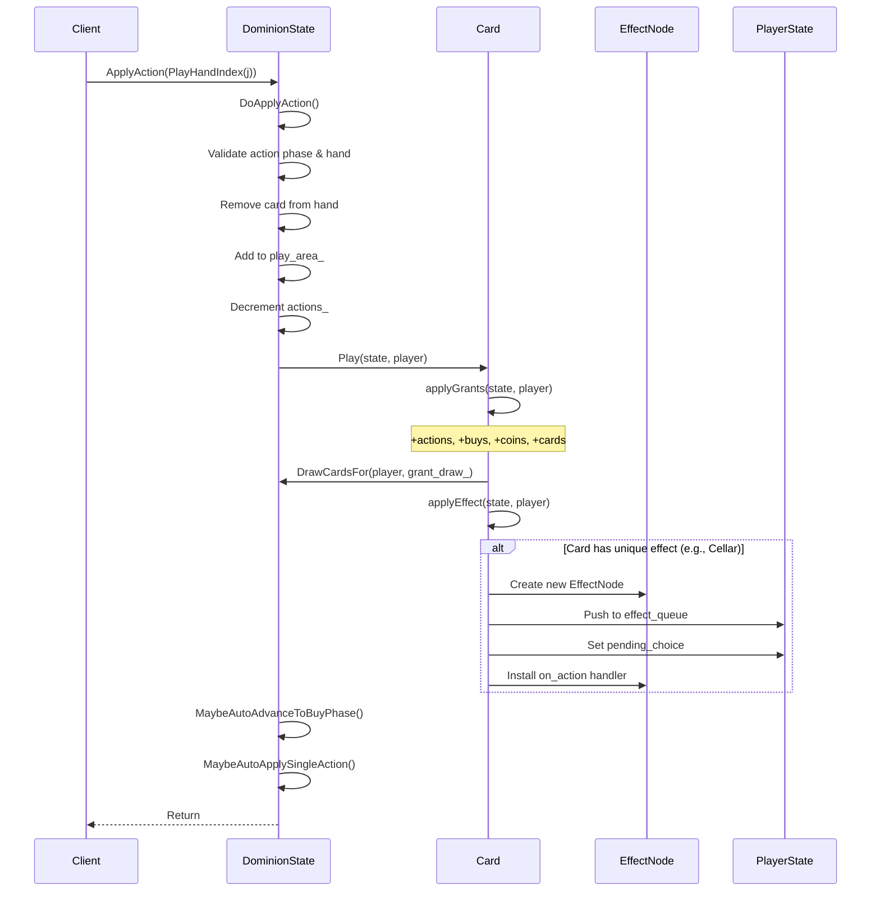
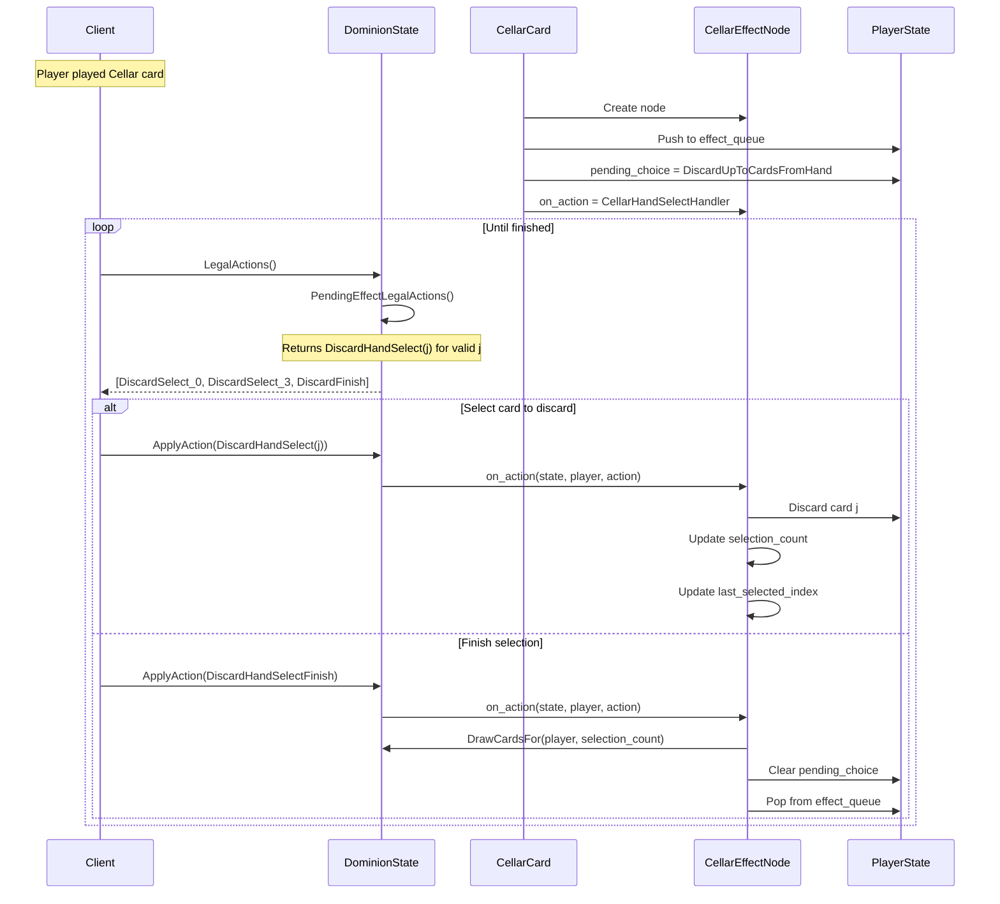
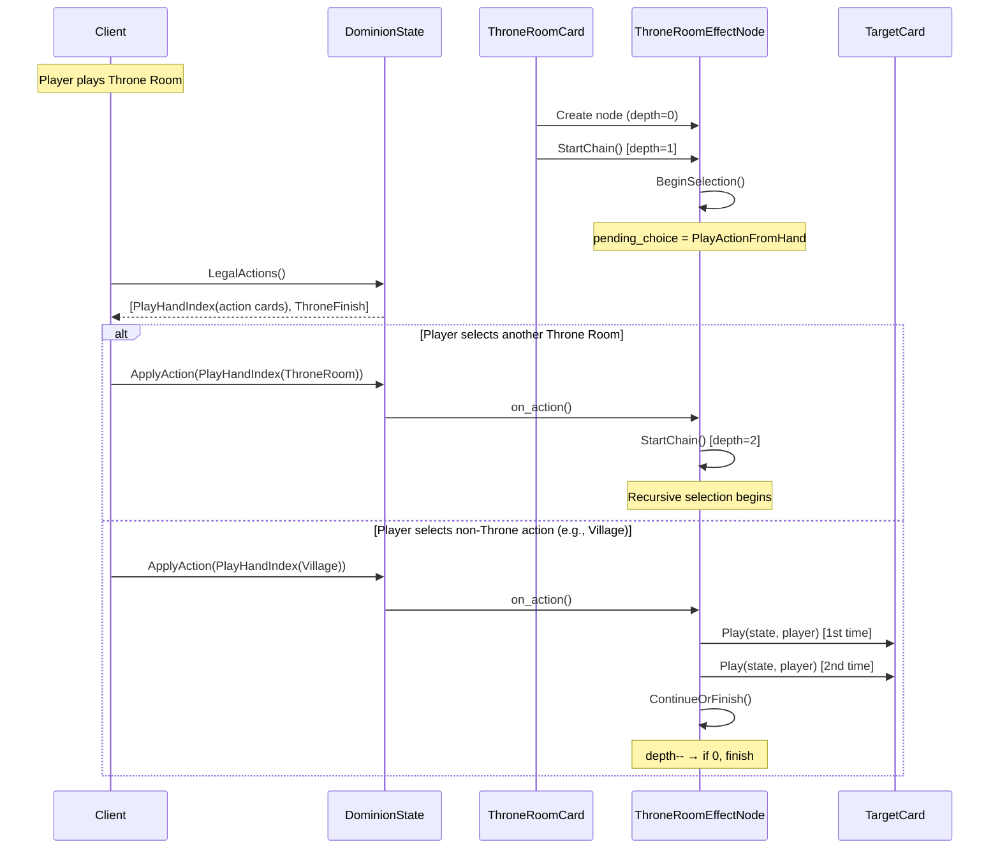
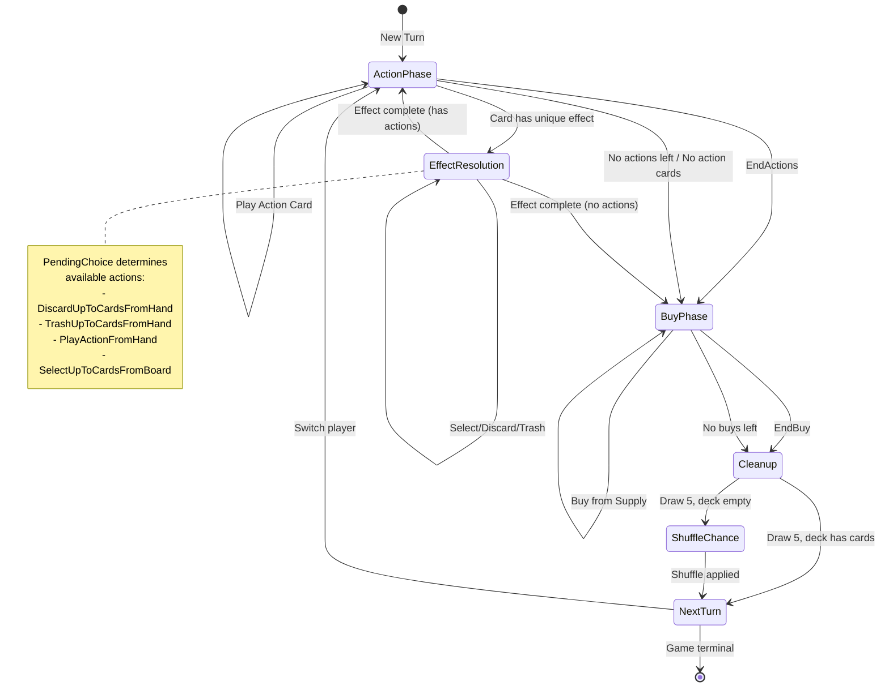

# Dominion-Transformer Design Document

## Table of Contents

1. [Executive Summary](#executive-summary)
2. [Project Overview](#project-overview)
3. [Architecture Overview](#architecture-overview)
4. [Core Components](#core-components)
5. [Code Structure](#code-structure)
6. [UML Diagrams](#uml-diagrams)
7. [Game Flow and State Management](#game-flow-and-state-management)
8. [OpenSpiel Integration](#openspiel-integration)
9. [Proposed Improvements](#proposed-improvements)
10. [Appendix](#appendix)

---

## Executive Summary

The **dominion-transformer** project is a C++ implementation of the popular deck-building card game Dominion, designed to be compatible with DeepMind's OpenSpiel framework. The primary goal is to enable AlphaZero-style reinforcement learning training on the game. The implementation features a modular card effect system, support for imperfect information game semantics, and JSON-based state serialization for training pipeline integration.

---

## Project Overview

### Purpose
- Implement Dominion as an OpenSpiel-compatible game environment
- Support AlphaZero training through proper game state representation
- Handle the complexity of Dominion's effect chain resolution system

### Scope
- **Current Implementation**: Base set cards with core game mechanics
- **Kingdom Cards**: Cellar, Chapel, Festival, Laboratory, Market, Merchant, Militia, Moat, Remodel, Smithy, ThroneRoom, Village, Witch, Workshop
- **Game Modes**: 2-player sequential play with sampled stochastic shuffling

### Key Design Goals
1. **OpenSpiel Compatibility**: Full integration with the OpenSpiel game interface
2. **Effect Chain Resolution**: Support for complex card interactions (e.g., Throne Room chaining)
3. **State Serializability**: Complete game state can be serialized/deserialized for MCTS
4. **Imperfect Information**: Proper handling of hidden information (opponent's deck/hand)

---

## Architecture Overview

### High-Level Architecture

```
┌─────────────────────────────────────────────────────────────────┐
│                        OpenSpiel Framework                       │
│  ┌─────────────┐  ┌─────────────┐  ┌─────────────────────────┐  │
│  │    Game     │  │    State    │  │    Bot/Agent Interface  │  │
│  │  Interface  │  │  Interface  │  │                         │  │
│  └──────┬──────┘  └──────┬──────┘  └────────────┬────────────┘  │
└─────────┼────────────────┼──────────────────────┼───────────────┘
          │                │                      │
          ▼                ▼                      ▼
┌─────────────────────────────────────────────────────────────────┐
│                    Dominion Game Engine                          │
│  ┌─────────────┐  ┌─────────────┐  ┌─────────────────────────┐  │
│  │DominionGame │  │DominionState│  │      PlayerState        │  │
│  │             │◄─┤             │◄─┤  ┌─────┐ ┌─────────┐    │  │
│  └─────────────┘  └──────┬──────┘  │  │Hand │ │EffectQ  │    │  │
│                          │         │  └─────┘ └─────────┘    │  │
│                          ▼         └─────────────────────────┘  │
│  ┌─────────────────────────────────────────────────────────┐    │
│  │                    Card System                           │    │
│  │  ┌──────────┐  ┌───────────────┐  ┌──────────────────┐  │    │
│  │  │   Card   │  │  CardRegistry │  │   EffectNode     │  │    │
│  │  │   Base   │  │               │  │   Hierarchy      │  │    │
│  │  └────┬─────┘  └───────────────┘  └────────┬─────────┘  │    │
│  │       │                                     │            │    │
│  │  ┌────┴────────────────────────────────────┴─────────┐  │    │
│  │  │ CellarCard │ ChapelCard │ MilitiaCard │ etc...    │  │    │
│  │  └───────────────────────────────────────────────────┘  │    │
│  └─────────────────────────────────────────────────────────┘    │
│                                                                  │
│  ┌─────────────────────────────────────────────────────────┐    │
│  │                   Action System                          │    │
│  │  ┌─────────────┐  ┌─────────────┐  ┌────────────────┐   │    │
│  │  │  ActionIds  │  │ActionNames  │  │ Action Ranges  │   │    │
│  │  │  Namespace  │  │  Namespace  │  │ (Play/Buy/etc) │   │    │
│  │  └─────────────┘  └─────────────┘  └────────────────┘   │    │
│  └─────────────────────────────────────────────────────────┘    │
└─────────────────────────────────────────────────────────────────┘
```

### Design Principles

1. **Separation of Concerns**: Card definitions, effect resolution, and game state management are decoupled
2. **Polymorphic Effects**: Each card with unique behavior has its own EffectNode subclass
3. **FIFO Effect Queue**: Effects are processed in order using a deque-based queue
4. **Stateless Card Specs**: Card specifications are singletons; runtime state lives in EffectNodes

---

## Core Components

### 1. DominionGame (`dominion.hpp`)

The top-level game factory implementing OpenSpiel's `Game` interface.

**Responsibilities:**
- Register the game with OpenSpiel's game registry
- Create initial game states
- Define game parameters (players, utilities, max game length)
- Handle state deserialization

**Key Constants:**
```cpp
inline constexpr int kNumPlayers = 2;
inline constexpr int kDominionMaxDistinctActions = 4096;
inline constexpr int kNumCardTypes = 33;
inline constexpr int kNumSupplyPiles = kNumCardTypes;
```

### 2. DominionState (`dominion.hpp`, `dominion.cpp`)

The main game state class implementing OpenSpiel's `State` interface.

**Key Members:**
| Member | Type | Description |
|--------|------|-------------|
| `current_player_` | `int` | Active player (0 or 1) |
| `coins_` | `int` | Coins available for buying |
| `actions_` | `int` | Actions remaining this turn |
| `buys_` | `int` | Buys remaining this turn |
| `phase_` | `Phase` | Current phase (action/buy) |
| `supply_piles_` | `array<int, N>` | Supply pile counts |
| `play_area_` | `vector<CardName>` | Cards in play this turn |
| `player_states_` | `array<PlayerState, 2>` | Per-player state |

**Key Methods:**
- `LegalActions()`: Computes valid actions for current player
- `DoApplyAction()`: State transition logic
- `DrawCardsFor()`: Draw cards with shuffle-when-empty logic
- `ToStruct()`/`Serialize()`: JSON serialization for MCTS

### 3. PlayerState (`dominion.hpp`)

Per-player state container including deck composition and pending effects.

**Structure:**
```cpp
struct PlayerState {
  std::vector<CardName> deck_;                         // Ordered deck (top = back)
  std::array<int, kNumSupplyPiles> hand_counts_{};     // Hand by card type count
  std::array<int, kNumSupplyPiles> discard_counts_{};  // Discard by card type count
  PendingChoice pending_choice;                        // Active effect choice type
  std::deque<std::unique_ptr<EffectNode>> effect_queue; // FIFO effect queue
  std::unique_ptr<ObservationState> obs_state;         // Observation state reference
};
```

### 4. Card System (`cards.hpp`, `cards.cpp`)

**Card Base Class:**
```cpp
class Card {
  std::string name_;
  CardName kind_;
  std::vector<CardType> types_;
  int cost_, value_, vp_;
  int grant_action_, grant_draw_, grant_buy_;
  bool has_unique_effect_;
  
  void applyGrants(DominionState&, int player) const;
  virtual void applyEffect(DominionState&, int player) const;
  void Play(DominionState&, int player) const;
};
```

**Card Registry Pattern:**
- Singleton `CardRegistry()` holds all card specifications
- `GetCardSpec(CardName)` retrieves card by enumeration
- Derived cards (Cellar, Chapel, etc.) override `applyEffect()`

### 5. Effect System (`effects.hpp`, `effects.cpp`)

**EffectNode Hierarchy:**
```
EffectNode (abstract)
├── CellarEffectNode     - Discard-and-draw effect
├── ChapelEffectNode     - Trash up to 4 cards
├── RemodelTrashEffectNode - Trash phase of Remodel
├── RemodelGainEffectNode  - Gain phase of Remodel
├── MilitiaEffectNode    - Opponent discard to 3
├── ThroneRoomEffectNode - Play action twice (chainable)
├── WorkshopEffectNode   - Gain card costing ≤4
└── WitchEffectNode      - Give curse to opponents
```

**Selection State Structures:**
```cpp
struct HandSelectionStruct {
  int target_hand_size;           // Auto-finish threshold
  int last_selected_original_index; // Ascending constraint
  int selection_count;            // Cards selected so far
  bool allow_finish_selection;    // Can finish early?
};

struct GainFromBoardStruct {
  int max_cost;  // Maximum cost of gainable cards
};
```

### 6. Action System (`actions.hpp`, `actions.cpp`)

**Action ID Layout:**
```
┌─────────────────────────────────────────────────────────────────┐
│ Action ID Space (0 to ~200)                                     │
├─────────────────────────────────────────────────────────────────┤
│ [0-32]        PlayHandIndex(i)     - Play card type i           │
│ [33-65]       DiscardHandSelect(i) - Discard card type i        │
│ [66]          DiscardHandSelectFinish                           │
│ [67-99]       TrashHandSelect(i)   - Trash card type i          │
│ [100]         TrashHandSelectFinish                             │
│ [101]         ThroneHandSelectFinish                            │
│ [102]         EndActions                                        │
│ [103-135]     BuyFromSupply(j)     - Buy from pile j            │
│ [136]         EndBuy                                            │
│ [137-169]     GainSelect(j)        - Gain from pile j (effects) │
│ [170]         Shuffle              - Chance action              │
│ [171]         PlayNonTerminal      - Macro action               │
└─────────────────────────────────────────────────────────────────┘
```

---

## Code Structure

### Directory Layout

```
dominion-transformer/
├── README.md                 # Project documentation
├── game/
│   ├── CMakeLists.txt        # Build configuration
│   ├── BUILD.md              # Build instructions
│   ├── include/
│   │   ├── dominion.hpp      # Main game state/game classes
│   │   ├── cards.hpp         # Card definitions and registry
│   │   ├── actions.hpp       # Action ID system
│   │   └── effects.hpp       # Effect node hierarchy
│   └── src/
│       ├── dominion.cpp      # Game state implementation
│       ├── cards.cpp         # Card registry and base logic
│       ├── actions.cpp       # Action naming utilities
│       ├── effects.cpp       # Effect node implementations
│       ├── dominion_test.cpp # Unit tests for game logic
│       ├── cards_test.cpp    # Card-specific tests
│       └── cards/            # Per-card implementations
│           ├── cellar.cpp    
│           ├── chapel.cpp    
│           ├── militia.cpp   
│           ├── remodel.cpp   
│           ├── throne_room.cpp
│           ├── witch.cpp     
│           ├── workshop.cpp  
│           └── *_test.cpp    # Per-card tests
└── open_spiel/
    └── tests/
        ├── console_play_test.cc  # Interactive play testing
        └── console_play_test.h
```

### Build System

The project uses CMake with the following targets:
- `dominion_cpp_game` - Static library containing game logic
- `dominion_test` - Core game logic tests
- `dominion_cards_test` - Card-specific behavior tests
- `dominion_console_play` - Interactive console player

---

## UML Diagrams

### Class Diagram - Core Game Components



### Class Diagram - Card and Effect System



### Class Diagram - Effect Node Hierarchy



### Sequence Diagram - Playing an Action Card



### Sequence Diagram - Effect Resolution (Cellar Example)



### Sequence Diagram - Throne Room Chain Resolution



### State Diagram - Game Phases



---

## Game Flow and State Management

### Turn Structure

```
1. Action Phase
   ├── While actions > 0 AND has action cards:
   │   ├── Play action card (or composite PlayNonTerminal)
   │   ├── Resolve immediate grants (+actions, +cards, +coins, +buys)
   │   └── Resolve unique effects (may involve choices)
   └── EndActions → transition to Buy Phase

2. Buy Phase
   ├── Auto-play basic treasures on any buy action
   ├── While buys > 0:
   │   └── Buy card from supply (cost ≤ coins)
   └── EndBuy → Cleanup

3. Cleanup
   ├── Move hand to discard
   ├── Move play area to discard
   ├── Draw 5 cards (shuffle discard if needed)
   └── Switch to next player
```

### Effect Queue Processing

The effect queue uses a FIFO discipline:
1. When a card with a unique effect is played, an `EffectNode` is pushed
2. The front node's `on_action` handler processes player choices
3. Upon completion, the node is popped and the next effect (if any) proceeds

### Shuffling as Chance Event

When drawing requires cards but the deck is empty:
1. Set `shuffle_pending_ = true`
2. `CurrentPlayer()` returns `kChancePlayerId`
3. Only legal action is `ActionIds::Shuffle()`
4. Shuffle uses local RNG (sampled stochastic mode)
5. Resume drawing after shuffle completes

---

## OpenSpiel Integration

### Game Registration

```cpp
const GameType kGameType{
    "dominion",
    "Dominion (Base)",
    GameType::Dynamics::kSequential,
    GameType::ChanceMode::kSampledStochastic,
    GameType::Information::kImperfectInformation,
    GameType::Utility::kZeroSum,
    GameType::RewardModel::kTerminal,
    /*max_num_players=*/kNumPlayers,
    /*min_num_players=*/kNumPlayers,
    ...
};

REGISTER_SPIEL_GAME(kGameType, Factory);
```

### State Serialization

Full game state is serializable via `ToJson()`/`Serialize()`:
- Current player, coins, actions, buys, phase
- Supply pile counts
- Per-player deck, hand, discard counts
- Effect queue with all effect-local state
- Move number for history tracking

This enables:
- MCTS tree serialization
- Training data storage
- State checkpointing

### Information State

`InformationStateString(player)` provides:
- Player's own complete hand
- Own deck/discard sizes
- Opponent deck/hand/discard **sizes only** (not contents)
- Public supply pile counts
- Legal actions for current player

---

## Proposed Improvements

### 1. Code Maintainability

#### 1.2 Card Effect Interface Separation
**Issue**: `Card::applyEffect()` conflates effect initiation with card specification.

**Recommendation**: Extract effect logic into separate strategy objects:

```cpp
class CardEffect {
public:
    virtual void initiate(DominionState&, int player) const = 0;
    virtual bool handleAction(DominionState&, int player, Action) const = 0;
};

class Card {
    std::unique_ptr<CardEffect> effect_;  // null for cards without effects
};
```

**Benefits**: Cleaner separation, easier testing, supports card variants.

### 2. Efficiency Improvements

#### 2.1 Action Space Optimization
**Issue**: `kDominionMaxDistinctActions = 4096` is much larger than needed (~200 actual actions).

**Recommendation**: 
- Reduce to actual maximum: `~250` actions
- Use a more compact action encoding
- Consider action masking in neural network architecture

**Impact**: Smaller policy output layer, faster inference.

#### 2.2 Hand Representation Change
**Issue**: `array<int, kNumSupplyPiles>` hand counts require O(N) iteration for hand operations.

**Recommendation**: Use a sparse representation for hands:

```cpp
struct Hand {
    std::map<CardName, int> counts;  // or flat_map for better cache
    int total_size;
    
    void add(CardName c) { ++counts[c]; ++total_size; }
    void remove(CardName c) { --counts[c]; --total_size; }
};
```

**Trade-off**: Slightly more complex indexing but faster iteration over actual cards.

#### 2.3 Lazy Legal Action Computation
**Issue**: `LegalActions()` recomputes everything on each call.

**Recommendation**: Cache legal actions with dirty flag:

```cpp
class DominionState {
    mutable std::vector<Action> cached_legal_actions_;
    mutable bool legal_actions_dirty_ = true;
    
    void InvalidateLegalActions() { legal_actions_dirty_ = true; }
    std::vector<Action> LegalActions() const override {
        if (legal_actions_dirty_) {
            cached_legal_actions_ = ComputeLegalActions();
            legal_actions_dirty_ = false;
        }
        return cached_legal_actions_;
    }
};
```

**Impact**: Significant speedup for MCTS which calls `LegalActions()` repeatedly.

### 3. Logic Improvements

#### 3.1 Macro Action Enhancement
**Issue**: `PlayNonTerminal` macro action uses a simple heuristic.

**Recommendation**: Make the heuristic pluggable:

```cpp
using NonTerminalPolicy = std::function<Action(const DominionState&, int)>;

void SetNonTerminalPolicy(NonTerminalPolicy policy);
```

**Use cases**: 
- Default greedy heuristic for early training
- Learned policy injection for late-stage training
- Testing different exploration strategies

#### 3.2 Observation Tensor Implementation
**Issue**: `ObservationTensorShape()` returns empty; no tensor encoding exists.

**Recommendation**: Implement observation tensor for neural network training:

```cpp
std::vector<int> ObservationTensorShape() const override {
    // [supply_counts, hand_counts, opponent_sizes, 
    //  phase, actions, buys, coins, pending_choice_type]
    return {kNumSupplyPiles * 2 + 10 + /* effect state */ 20};
}

void ObservationTensor(int player, std::vector<float>& out) const override;
```

#### 3.3 Reaction Card Support
**Issue**: Attack cards (Militia, Witch) don't check for Moat reactions.

**Recommendation**: Add reaction phase to attack resolution:

```cpp
bool CanBlock(int player, CardName attack_card) const;
void ResolveReactions(int attacker, CardName attack_card);
```

### 4. Testing Improvements

#### 4.1 Property-Based Testing
**Recommendation**: Add randomized testing:

```cpp
void FuzzTestRandomPlaythrough(int seed, int max_turns);
void PropertyTestLegalActionsNeverEmpty();
void PropertyTestSerializeDeserializeRoundTrip();
```

#### 4.2 Performance Benchmarks
**Recommendation**: Add benchmarks for critical paths:

```cpp
BENCHMARK(BM_LegalActionsComputation);
BENCHMARK(BM_StateClone);
BENCHMARK(BM_SerializeDeserialize);
BENCHMARK(BM_RandomPlaythrough);
```

### 5. Architecture Improvements

#### 5.1 Plugin-Based Card Loading
**Recommendation**: Support runtime card registration for expansion packs:

```cpp
class CardPlugin {
public:
    virtual std::vector<std::unique_ptr<Card>> GetCards() = 0;
    virtual std::string ExpansionName() const = 0;
};

void RegisterExpansion(std::unique_ptr<CardPlugin> plugin);
```

#### 5.2 Kingdom Configuration
**Issue**: Kingdom is hardcoded in `DominionState` constructor.

**Recommendation**: Make kingdom configurable via game parameters:

```cpp
GameParameters params;
params["kingdom"] = "cellar,chapel,village,smithy,militia,...";
auto game = LoadGame("dominion", params);
```

### Summary of Priority Improvements

| Priority | Improvement | Effort | Impact |
|----------|-------------|--------|--------|
| 🔴 High | Observation Tensor Implementation | Medium | Critical for training |
| 🔴 High | Legal Action Caching | Low | Performance |
| 🟡 Medium | Kingdom Configuration | Medium | Flexibility |
| 🟢 Low | Sparse Hand Representation | Medium | Performance |
| 🟢 Low | Reaction Card Support | High | Game completeness |
| 🟢 Low | Plugin Card Loading | High | Extensibility |

---

## Appendix

### A. CardName Enumeration

```cpp
enum class CardName {
    // Basic supply (0-6)
    CARD_Copper, CARD_Silver, CARD_Gold,
    CARD_Estate, CARD_Duchy, CARD_Province, CARD_Curse,
    
    // Base set actions (7-32)
    CARD_Artisan, CARD_Bandit, CARD_Bureaucrat, CARD_Cellar,
    CARD_Chapel, CARD_CouncilRoom, CARD_Festival, CARD_Gardens,
    CARD_Harbinger, CARD_Laboratory, CARD_Library, CARD_Market,
    CARD_Merchant, CARD_Militia, CARD_Mine, CARD_Moat,
    CARD_Moneylender, CARD_Poacher, CARD_Remodel, CARD_Sentry,
    CARD_Smithy, CARD_ThroneRoom, CARD_Vassal, CARD_Village,
    CARD_Witch, CARD_Workshop
};
```

### B. PendingChoice Enumeration

```cpp
enum class PendingChoice : int {
    None = 0,
    DiscardUpToCardsFromHand = 1,
    TrashUpToCardsFromHand = 2,
    PlayActionFromHand = 3,
    SelectUpToCardsFromBoard = 4,
};
```

### C. Build Commands

```bash
# Build all targets
cmake --build /path/to/game/build -j 8

# Run tests
./game/build/dominion_test
./game/build/dominion_cards_test

# Interactive play
./game/build/dominion_console_play
```

---

*Document Version: 1.0*  
*Last Updated: November 2025*
