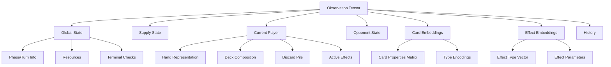
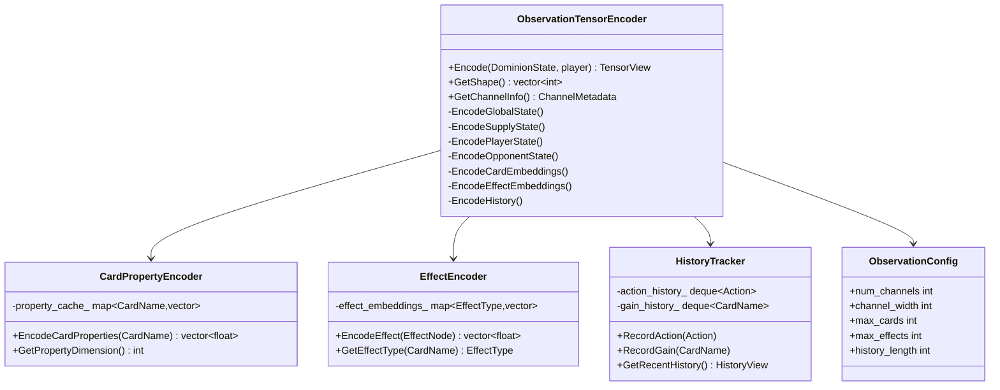

# Dominion Observation Tensor Design Document

## Executive Summary

This document proposes a comprehensive observation tensor design for the Dominion deck-building game, suitable for AlphaZero reinforcement learning training. The design emphasizes **extensibility**, **rich state representation**, and **imperfect information modeling** while maintaining compatibility with future expansions.

## 1. Design Philosophy

### 1.1 Core Principles

1. **Imperfect Information Fidelity**: The tensor represents only information available to the current player, matching Information State MCTS requirements
2. **Semantic Card Representation**: Cards encoded by properties and effects rather than just indices, enabling generalization
3. **Future-Proof Architecture**: Pre-allocated capacity for expansions (targeting 500+ cards, 100+ unique effects)
4. **Learnable Embeddings**: Separate embedding spaces for card properties and unique effects
5. **Efficient Encoding**: Balance between richness and computational cost

### 1.2 Inspiration from Existing Games

Drawing from successful observation tensor designs:
- **Chess/Go**: Board state + auxiliary channels (move counts, repetition)
- **Poker**: Hand encoding + public/private information separation
- **Magic: The Gathering Arena**: Card property vectors + zone representations
- **Hearthstone**: Minion/spell attributes + game phase encoding

## 2. Observation Tensor Architecture

### 2.1 Overall Structure

```
┌─────────────────────────────────────────────────────────────┐
│ Dominion Observation Tensor                                 │
│ Shape: [NUM_CHANNELS, TENSOR_WIDTH]                         │
│ Total Size: ~15,000 - 20,000 values                        │
├─────────────────────────────────────────────────────────────┤
│ Section 1: Global Game State        [Channels  0-9]        │
│ Section 2: Supply State              [Channels 10-11]       │
│ Section 3: Current Player State      [Channels 12-99]       │
│ Section 4: Opponent State            [Channels 100-149]     │
│ Section 5: Card Property Embeddings  [Channels 150-199]     │
│ Section 6: Effect Embeddings         [Channels 200-249]     │
│ Section 7: Sequence History          [Channels 250-299]     │
└─────────────────────────────────────────────────────────────┘
```

**Recommended Tensor Dimensions:**
- **Primary Shape**: `[300, 64]` = 19,200 values
- **Alternative Compact**: `[150, 100]` = 15,000 values
- **Alternative Rich**: `[400, 50]` = 20,000 values

The width of 64 provides natural alignment with typical card vocabulary sizes and allows for padding/future expansion.

### 2.2 Section Breakdown



## 3. Detailed Component Encoding

### 3.1 Global Game State (Channels 0-9)

```cpp
// Channel 0: Phase and Turn Metadata
[current_player_one_hot(2),    // [1,0] or [0,1]
 phase_one_hot(2),             // actionPhase=1,0 or buyPhase=0,1
 turn_number_normalized,        // turn/100 (capped)
 game_progress_estimate,        // provinces_taken/8
 empty_piles_count,            // count/10
 ...padding(57)]

// Channel 1: Current Player Resources
[actions_normalized,           // actions/10
 buys_normalized,              // buys/10
 coins_normalized,             // coins/20
 effective_coins_normalized,   // (coins + treasure_in_hand)/20
 ...padding(60)]

// Channel 2-3: Terminal Condition Checks
[provinces_remaining,          // count/8
 piles_empty_one_hot(10),      // binary flags for key piles
 is_terminal,
 ...padding(53)]

// Channels 4-9: Reserved for future global features
```

**Key Design Decisions:**
- Normalization bounds chosen based on typical game values
- One-hot encoding for categorical variables
- Padding ensures space for expansions (Potions, Debt, Favors, etc.)

### 3.2 Supply State (Channels 10-11)

```cpp
// Channel 10: Supply Counts (Normalized)
// Index i corresponds to CardName enum value i
[supply_pile[0]/60,    // Copper (max 60)
 supply_pile[1]/40,    // Silver (max 40)
 supply_pile[2]/30,    // Gold (max 30)
 supply_pile[3]/8,     // Estate
 supply_pile[4]/8,     // Duchy
 supply_pile[5]/8,     // Province
 supply_pile[6]/10,    // Curse
 supply_pile[7]/10,    // Cellar
 ...
 supply_pile[32]/10,   // Last base card
 ...padding(31)]       // Space for 500 total cards

// Channel 11: Supply Availability Flags (Binary)
[pile_available[0],    // 1 if count > 0, else 0
 pile_available[1],
 ...
 pile_available[32],
 ...padding(31)]
```

**Extensibility**: 64-width allows encoding up to 500+ cards from all expansions

### 3.3 Current Player State (Channels 12-99)

#### 3.3.1 Hand Representation (Channels 12-26)

```cpp
// Channel 12: Hand Counts (Normalized)
[hand_count[0]/max_hand_size,   // For each card type
 hand_count[1]/max_hand_size,
 ...
 hand_count[32]/max_hand_size,
 ...padding(31)]

// Channel 13: Hand Types Aggregation
[treasure_cards_in_hand,        // Count of treasures
 action_cards_in_hand,          // Count of actions
 victory_cards_in_hand,         // Count of victory
 total_hand_size,               // Total cards
 ...padding(60)]

// Channels 14-18: Hand Card Property Aggregates
// Channel 14: Total Cost in Hand
[sum(card_cost * card_count for card in hand) / 100,
 avg_cost_in_hand / 10,
 ...padding(62)]

// Channel 15: Total Actions Grantable
[sum(card.grant_action * count) / 20,
 ...padding(63)]

// Channel 16: Total Draws Grantable
[sum(card.grant_draw * count) / 20,
 ...padding(63)]

// Channel 17: Total Buys Grantable
[sum(card.grant_buy * count) / 10,
 ...padding(63)]

// Channel 18: Total Treasure Value
[sum(card.value * count) / 50,
 ...padding(63)]

// Channels 19-26: Reserved for hand-specific features
```

#### 3.3.2 Deck Representation (Channels 27-41)

**Critical Design Choice**: Deck order is hidden in imperfect information. We encode **composition** only.

```cpp
// Channel 27: Deck Composition Counts
[deck_card_count[0]/deck_size,  // Normalized by deck size
 deck_card_count[1]/deck_size,
 ...
 deck_card_count[32]/deck_size,
 ...padding(31)]

// Channel 28: Deck Aggregates
[total_deck_size/60,            // Normalized deck size
 treasure_density,              // treasure_count/deck_size
 action_density,
 victory_density,
 avg_card_cost_in_deck/10,
 ...padding(59)]

// Channels 29-35: Deck Property Aggregates
// Similar structure to hand property aggregates

// Channels 36-41: Reserved for deck-specific features
```

#### 3.3.3 Discard Pile (Channels 42-56)

```cpp
// Channel 42: Discard Counts
[discard_count[0]/discard_size,
 discard_count[1]/discard_size,
 ...
 discard_count[32]/discard_size,
 ...padding(31)]

// Channel 43: Discard Aggregates
[total_discard_size/60,
 treasure_in_discard,
 action_in_discard,
 victory_in_discard,
 ...padding(60)]

// Channels 44-50: Discard Property Aggregates

// Channels 51-56: Reserved
```

#### 3.3.4 Active Effects State (Channels 57-71)

```cpp
// Channel 57: Effect Queue State
[has_pending_effect,            // Binary
 effect_queue_depth,            // Normalized /5
 pending_choice_one_hot(5),     // None, Discard, Trash, Play, Gain
 ...padding(57)]

// Channel 58: Current Effect Details
[effect_target_hand_size/10,    // For Militia-like effects
 effect_max_cost/10,            // For Workshop-like effects
 effect_selection_count/10,     // How many selected so far
 throne_depth/5,                // Throne Room chain depth
 ...padding(60)]

// Channels 59-65: Effect-Specific Parameters
// Different channels for different effect types

// Channels 66-71: Reserved for effect state
```

#### 3.3.5 Play Area (Channels 72-86)

```cpp
// Channel 72: Play Area Counts
[play_area_count[0],            // Raw counts
 play_area_count[1],
 ...
 play_area_count[32],
 ...padding(31)]

// Channel 73: Play Area Properties
[total_cards_in_play/20,
 actions_played_this_turn/10,
 treasures_played_this_turn/10,
 ...padding(61)]

// Channels 74-86: Reserved for play area features
```

#### 3.3.6 Total Collection Stats (Channels 87-99)

```cpp
// Channel 87: Total Collection (Deck + Hand + Discard)
[total_card_count[0]/total_cards,
 total_card_count[1]/total_cards,
 ...
 total_card_count[32]/total_cards,
 ...padding(31)]

// Channel 88-92: Victory Point Calculations
[current_vp_estimate/50,        // Estimated current VP
 potential_vp_if_buy_province/50,
 gardens_vp_per_card,           // If Gardens owned
 ...padding(61)]

// Channels 93-99: Reserved for collection stats
```

### 3.4 Opponent State (Channels 100-149)

**Imperfect Information**: Only publicly visible or inferrable data

```cpp
// Channel 100: Opponent Sizes
[opponent_hand_size/20,
 opponent_deck_size/60,
 opponent_discard_size/60,
 opponent_total_cards/60,
 ...padding(60)]

// Channel 101: Opponent Known Cards
// Cards revealed through attacks, discards, etc.
[known_card_count[0]/opponent_total,
 known_card_count[1]/opponent_total,
 ...
 known_card_count[32]/opponent_total,
 ...padding(31)]

// Channel 102-110: Opponent Aggregates
[opponent_estimated_vp/50,
 opponent_provinces_bought,
 opponent_treasure_density_estimate,
 ...padding(61)]

// Channels 111-149: Reserved for opponent modeling
```

### 3.5 Card Property Embeddings (Channels 150-199)

**Innovative Feature**: Pre-computed embeddings capturing card semantics

```cpp
// Embedding Matrix Structure
// Each card type gets a property vector

// Channel 150-157: Card Cost and Type Encoding (8 channels)
// For each of 64 card slots (500 future cards mapped to 64 bins):
Channel[150][card_idx] = card.cost / 10
Channel[151][card_idx] = is_treasure(card)
Channel[152][card_idx] = is_action(card)
Channel[153][card_idx] = is_victory(card)
Channel[154][card_idx] = is_curse(card)
Channel[155][card_idx] = is_attack(card)
Channel[156][card_idx] = is_reaction(card)  // Future
Channel[157][card_idx] = is_duration(card)  // Future

// Channels 158-165: Grant Properties (8 channels)
Channel[158][card_idx] = card.grant_action / 5
Channel[159][card_idx] = card.grant_draw / 5
Channel[160][card_idx] = card.grant_buy / 5
Channel[161][card_idx] = card.value / 5       // Treasure value
Channel[162][card_idx] = card.vp / 10         // Victory points
Channel[163][card_idx] = card.grant_coins / 5 // Future
Channel[164][card_idx] = card.potion_cost     // Future
Channel[165][card_idx] = card.debt_cost / 10  // Future

// Channels 166-173: Effect Indicators (8 channels)
Channel[166][card_idx] = has_unique_effect(card)
Channel[167][card_idx] = has_discard_effect(card)
Channel[168][card_idx] = has_trash_effect(card)
Channel[169][card_idx] = has_gain_effect(card)
Channel[170][card_idx] = has_attack_effect(card)
Channel[171][card_idx] = has_defensive_effect(card)
Channel[172][card_idx] = has_multiplier_effect(card) // Throne-like
Channel[173][card_idx] = has_conditional_effect(card)

// Channels 174-199: Reserved for additional card properties
// - Drawing mechanics
// - Trashing mechanics
// - Interaction patterns
// - Combo enablers
```

**Usage Pattern**: Neural network learns to combine these property channels with card count channels to understand hand/deck composition semantically.

### 3.6 Effect Embeddings (Channels 200-249)

**Purpose**: Encode unique card effects in learnable embedding space

```cpp
// Effect Vocabulary (Pre-allocated for 100 unique effects)
enum class EffectType {
  CELLAR_DISCARD_DRAW = 0,
  CHAPEL_TRASH = 1,
  WORKSHOP_GAIN = 2,
  MILITIA_ATTACK = 3,
  REMODEL_TRASH_UPGRADE = 4,
  THRONE_DOUBLE = 5,
  WITCH_CURSE = 6,
  // ... up to 99 for future expansions
};

// Channels 200-207: Effect Type One-Hot (for active effects)
// Multi-hot encoding of all active effects
Channel[200][effect_idx] = effect_is_active[0]
Channel[201][effect_idx] = effect_is_active[1]
...
Channel[207][effect_idx] = effect_is_active[7]

// Channels 208-215: Effect Parameters
Channel[208][0:16] = cellar_discard_count / 10
Channel[208][16:32] = chapel_trash_count / 5
Channel[208][32:48] = workshop_max_cost / 10
Channel[208][48:64] = militia_target_size / 10

// Channels 216-230: Effect State Embeddings
// Learnable embeddings for complex effect states
// Network learns to encode "Throne Room with depth 2 selecting Market"
// vs "Throne Room with depth 1 selecting Smithy"

// Channels 231-249: Reserved for effect embeddings
```

### 3.7 Sequence History (Channels 250-299)

**Purpose**: Capture recent action sequences for temporal reasoning

```cpp
// Last N turns history (e.g., N=5)
// Channels 250-254: Last 5 Actions Taken
Channel[250][0:10] = last_action_type_one_hot  // Play/Buy/End/etc
Channel[250][10:20] = last_action_card_idx / 64
Channel[250][20:30] = last_action_cost / 10
// ... repeat for channels 251-254

// Channels 255-259: Last 5 Cards Gained
Channel[255][0:10] = last_gain_card_idx / 64
Channel[255][10:20] = last_gain_cost / 10
Channel[255][20:30] = last_gain_source / 5  // Buy vs gain
// ... repeat for channels 256-259

// Channels 260-269: Action Sequence Statistics
[actions_played_last_3_turns,
 buys_made_last_3_turns,
 provinces_bought_last_3_turns,
 ...padding]

// Channels 270-299: Reserved for history features
```

## 4. Implementation Proposal

### 4.1 Required Library Components

```cpp
// Core dependencies
#include "absl/types/span.h"
#include "tensorflow/core/framework/tensor.h"  // Or PyTorch equivalent
#include "open_spiel/spiel.h"
#include "open_spiel/tensor_view.h"

// New dependencies to add
#include "eigen3/Eigen/Core"  // For efficient matrix operations
#include "absl/container/flat_hash_map.h"  // For card->embedding lookups
```

### 4.2 Core Classes



### 4.3 StateStruct Improvements

**Current Issues with DominionStateStruct:**
1. No normalization metadata
2. No card property caching
3. No history tracking
4. Missing effect parameter details

**Proposed Enhanced StateStruct:**

```cpp
struct EnhancedDominionStateStruct : public DominionStateStruct {
  // Add caching for expensive computations
  mutable std::optional<Eigen::MatrixXf> cached_observation_tensor_;
  mutable bool tensor_cache_valid_ = false;
  
  // Add history tracking
  std::deque<Action> action_history_;
  std::deque<CardName> gain_history_;
  std::deque<int> turn_vp_history_;
  
  // Add normalization bounds (learned from data)
  struct NormalizationParams {
    float max_hand_size = 20.0f;
    float max_deck_size = 60.0f;
    float max_coins = 50.0f;
    float max_actions = 20.0f;
    float max_buys = 10.0f;
    float max_vp = 100.0f;
  } norm_params_;
  
  // Add effect state details
  struct EffectStateDetails {
    EffectType current_effect_type;
    std::vector<float> effect_parameters;
    int effect_start_turn;
  };
  std::vector<EffectStateDetails> detailed_effects_;
  
  // Invalidate cache on state mutation
  void InvalidateCache() { tensor_cache_valid_ = false; }
  
  // Serialization support
  NLOHMANN_DEFINE_TYPE_INTRUSIVE_WITH_DEFAULT(
    EnhancedDominionStateStruct,
    /* base class fields */,
    action_history_,
    gain_history_,
    turn_vp_history_,
    detailed_effects_
  )
};
```

### 4.4 Multi-Phase Implementation Plan

#### **Phase 1: Foundation (Weeks 1-3)**

**Goals:**
- Basic tensor encoding with one-hot and count features
- Integration with existing DominionState
- Unit tests for encoding correctness

**Deliverables:**
```cpp
class BasicObservationEncoder {
  // Implements channels 0-149 (global, supply, player, opponent)
  // No embeddings yet, just raw counts and one-hot
  
  static constexpr int kNumChannels = 150;
  static constexpr int kChannelWidth = 64;
  
  std::vector<float> Encode(const DominionState& state, Player player);
  
 private:
  void EncodeGlobalState(absl::Span<float> output, const DominionState& state);
  void EncodeSupplyState(absl::Span<float> output, const DominionState& state);
  void EncodePlayerHand(absl::Span<float> output, const PlayerState& ps);
  void EncodePlayerDeck(absl::Span<float> output, const PlayerState& ps);
  void EncodePlayerDiscard(absl::Span<float> output, const PlayerState& ps);
  void EncodeOpponent(absl::Span<float> output, const DominionState& state, Player opp);
};
```

**Testing:**
```cpp
TEST(BasicObservationEncoder, HandEncoding) {
  DominionState state = CreateTestState();
  AddCardToHand(&state, 0, CardName::CARD_Smithy, 2);
  
  BasicObservationEncoder encoder;
  auto tensor = encoder.Encode(state, 0);
  
  // Verify Smithy count is in correct channel/position
  int smithy_idx = static_cast<int>(CardName::CARD_Smithy);
  float expected = 2.0f / kMaxHandSize;
  EXPECT_NEAR(tensor[12 * 64 + smithy_idx], expected, 1e-6);
}
```

#### **Phase 2: Card Property Embeddings (Weeks 4-6)**

**Goals:**
- Implement card property encoder (channels 150-199)
- Create property database for all current cards
- Enable property-based queries

**Deliverables:**
```cpp
class CardPropertyDatabase {
 public:
  struct CardProperties {
    int cost;
    std::vector<CardType> types;
    int grant_action, grant_draw, grant_buy;
    int value, vp;
    bool has_unique_effect;
    std::set<std::string> effect_tags;  // "discard", "trash", "gain", etc.
  };
  
  static const CardProperties& GetProperties(CardName card);
  static std::vector<float> EncodeProperties(CardName card);
  
 private:
  static void InitializeDatabase();
  static absl::flat_hash_map<CardName, CardProperties> property_db_;
};

class PropertyAwareEncoder : public BasicObservationEncoder {
  // Extends basic encoder with channels 150-199
  static constexpr int kNumChannels = 200;
  
  void EncodeCardProperties(absl::Span<float> output);
};
```

**Data Structure:**
```cpp
// Example: Property database initialization
void CardPropertyDatabase::InitializeDatabase() {
  property_db_[CardName::CARD_Smithy] = CardProperties{
    .cost = 4,
    .types = {CardType::ACTION},
    .grant_action = 0,
    .grant_draw = 3,
    .grant_buy = 0,
    .value = 0,
    .vp = 0,
    .has_unique_effect = false,
    .effect_tags = {"draw"}
  };
  
  property_db_[CardName::CARD_Cellar] = CardProperties{
    .cost = 2,
    .types = {CardType::ACTION},
    .grant_action = 1,
    .grant_draw = 0,
    .grant_buy = 0,
    .value = 0,
    .vp = 0,
    .has_unique_effect = true,
    .effect_tags = {"discard", "draw", "filter"}
  };
  
  // ... continue for all cards
}
```

#### **Phase 3: Effect Embeddings (Weeks 7-9)**

**Goals:**
- Implement effect type classification
- Create effect parameter encoder (channels 200-249)
- Handle complex effect states (Throne Room, etc.)

**Deliverables:**
```cpp
class EffectTypeClassifier {
 public:
  static EffectType ClassifyEffect(const EffectNode& node);
  static std::vector<float> EncodeEffectParameters(const EffectNode& node);
  
 private:
  struct EffectSignature {
    std::string effect_name;
    PendingChoice choice_type;
    std::function<std::vector<float>(const EffectNode&)> param_encoder;
  };
  
  static absl::flat_hash_map<CardName, EffectSignature> effect_signatures_;
};

class FullObservationEncoder : public PropertyAwareEncoder {
  // Extends with channels 200-249
  static constexpr int kNumChannels = 250;
  
  void EncodeEffectState(absl::Span<float> output, const PlayerState& ps);
  void EncodeEffectQueue(absl::Span<float> output, const std::deque<std::unique_ptr<EffectNode>>& queue);
};
```

**Effect Encoding Example:**
```cpp
std::vector<float> EncodeCellarEffect(const EffectNode& node) {
  const auto* hs = node.hand_selection();
  return {
    hs ? hs->selection_count_value() / 10.0f : 0.0f,
    hs ? (hs->allow_finish_selection() ? 1.0f : 0.0f) : 0.0f,
    0.0f, 0.0f  // padding
  };
}

std::vector<float> EncodeWorkshopEffect(const EffectNode& node) {
  const auto* gs = node.gain_from_board();
  return {
    gs ? gs->max_cost / 10.0f : 0.0f,
    0.0f, 0.0f, 0.0f  // padding
  };
}

std::vector<float> EncodeThroneEffect(const EffectNode& node) {
  const auto* tr = dynamic_cast<const ThroneRoomEffectNode*>(&node);
  return {
    tr ? tr->throne_depth() / 5.0f : 0.0f,
    0.0f, 0.0f, 0.0f  // padding
  };
}
```

#### **Phase 4: History and Optimization (Weeks 10-12)**

**Goals:**
- Implement history tracker (channels 250-299)
- Add caching and batch encoding
- Performance optimization
- Integration with AlphaZero pipeline

**Deliverables:**
```cpp
class HistoryAwareEncoder : public FullObservationEncoder {
  // Complete encoder with all channels
  static constexpr int kNumChannels = 300;
  
  void EncodeHistory(absl::Span<float> output, const HistoryTracker& history);
  
  // Batch encoding support
  Eigen::MatrixXf EncodeBatch(const std::vector<const DominionState*>& states,
                               const std::vector<Player>& players);
};

class ObservationTensorCache {
 public:
  const Eigen::MatrixXf& GetOrCompute(
    const DominionState& state,
    Player player,
    const HistoryAwareEncoder& encoder);
  
  void Invalidate(const DominionState& state);
  
 private:
  absl::flat_hash_map<StateId, Eigen::MatrixXf> cache_;
  size_t max_cache_size_ = 10000;
};
```

**Integration with OpenSpiel:**
```cpp
// In dominion_game.cc
std::vector<int> DominionGame::ObservationTensorShape() const override {
  return {kObservationNumChannels, kObservationChannelWidth};
}

void DominionState::ObservationTensor(Player player,
                                      absl::Span<float> values) const override {
  HistoryAwareEncoder encoder;
  auto tensor = encoder.Encode(*this, player);
  std::copy(tensor.begin(), tensor.end(), values.begin());
}
```

## 5. Advanced Features and Future Considerations

### 5.1 Learnable Card Embeddings

Instead of hand-crafted property vectors, consider learning card embeddings during training:

```cpp
class LearnableCardEmbedder {
 public:
  // Initialize with random embeddings
  LearnableCardEmbedder(int vocab_size, int embedding_dim);
  
  // Get embedding for a card (to be learned by neural network)
  Eigen::VectorXf GetEmbedding(CardName card) const;
  
  // Update embeddings during training
  void UpdateEmbedding(CardName card, const Eigen::VectorXf& gradient);
  
 private:
  Eigen::MatrixXf embedding_matrix_;  // [vocab_size, embedding_dim]
};
```

**Advantages:**
- Network learns optimal representations for current task
- Captures implicit card relationships
- Generalizes to unseen card combinations

**Implementation in NN:**
```python
# PyTorch example
class DominionPolicyNetwork(nn.Module):
    def __init__(self):
        super().__init__()
        self.card_embedding = nn.Embedding(500, 32)  # 500 cards, 32-dim
        self.conv_layers = nn.Sequential(...)
        
    def forward(self, obs_tensor):
        # obs_tensor: [batch, channels, width]
        # Extract card indices from count channels
        card_indices = self.extract_card_indices(obs_tensor)
        embeddings = self.card_embedding(card_indices)
        
        # Combine embeddings with raw features
        combined = torch.cat([obs_tensor, embeddings], dim=1)
        return self.conv_layers(combined)
```

### 5.2 Attention Mechanisms for Card Interactions

For complex card interactions (e.g., Throne Room + Village + Smithy):

```cpp
class CardInteractionEncoder {
 public:
  // Encode pairwise card interactions in hand
  Eigen::MatrixXf EncodeInteractions(
    const std::array<int, kNumSupplyPiles>& hand_counts);
  
 private:
  // Attention-like weights between card pairs
  float ComputeInteractionWeight(CardName card1, CardName card2);
};
```

### 5.3 Dynamic Expansion Support

When new expansions are added:

```cpp
class ExpandableObservationConfig {
 public:
  void RegisterExpansion(const std::string& expansion_name,
                        const std::vector<CardName>& new_cards);
  
  // Remap old card indices to expanded vocabulary
  int RemapCardIndex(CardName card) const;
  
  // Get updated tensor shape
  std::vector<int> GetExpandedShape() const;
  
 private:
  std::vector<std::string> loaded_expansions_;
  absl::flat_hash_map<CardName, int> card_to_index_;
  int current_vocab_size_;
};
```

## 6. Data Quality and Validation

### 6.1 Validation Tests

```cpp
class ObservationTensorValidator {
 public:
  // Verify all values are in valid ranges
  static bool ValidateRanges(absl::Span<const float> tensor);
  
  // Check for NaN/Inf
  static bool ValidateNumerics(absl::Span<const float> tensor);
  
  // Verify tensor matches state
  static bool ValidateConsistency(
    const DominionState& state,
    absl::Span<const float> tensor,
    Player player);
  
  // Check imperfect information leakage
  static bool ValidateInformationLeakage(
    const DominionState& state,
    absl::Span<const float> tensor,
    Player player);
};
```

### 6.2 Unit Test Examples

```cpp
TEST(ObservationEncoder, ImperfectInformationPreserved) {
  DominionState state = CreateTestState();
  
  // Opponent's hand should not be visible
  AddCardToHand(&state, 1, CardName::CARD_Province, 2);
  
  HistoryAwareEncoder encoder;
  auto tensor = encoder.Encode(state, 0);
  
  // Verify opponent hand counts are NOT in tensor
  int opp_hand_channel = 100;
  for (int i = 0; i < kNumSupplyPiles; ++i) {
    EXPECT_EQ(tensor[opp_hand_channel * 64 + i], 0.0f)
      << "Opponent hand cards leaked to player 0's observation";
  }
  
  // But opponent hand SIZE should be visible
  int opp_size_channel = 100;
  EXPECT_GT(tensor[opp_size_channel * 64 + 0], 0.0f)
    << "Opponent hand size should be visible";
}

TEST(ObservationEncoder, DeckOrderHidden) {
  DominionState state = CreateTestState();
  auto& ps = state.player_states_[0];
  
  // Create deck with known order
  ps.deck_ = {CardName::CARD_Gold, CardName::CARD_Province, 
              CardName::CARD_Copper, CardName::CARD_Estate};
  
  HistoryAwareEncoder encoder;
  auto tensor1 = encoder.Encode(state, 0);
  
  // Shuffle deck (different order, same composition)
  std::shuffle(ps.deck_.begin(), ps.deck_.end(), rng);
  
  auto tensor2 = encoder.Encode(state, 0);
  
  // Deck composition channels should be identical
  for (int ch = 27; ch < 42; ++ch) {
    for (int i = 0; i < 64; ++i) {
      EXPECT_NEAR(tensor1[ch * 64 + i], tensor2[ch * 64 + i], 1e-6)
        << "Deck order leaked into observation";
    }
  }
}

TEST(ObservationEncoder, NormalizationBounds) {
  DominionState state = CreateTestState();
  state.coins_ = 100;  // Extreme value
  
  HistoryAwareEncoder encoder;
  auto tensor = encoder.Encode(state, 0);
  
  // All values should be in [0, 1] or [-1, 1] range
  for (float val : tensor) {
    EXPECT_GE(val, -1.0f) << "Value below normalization range";
    EXPECT_LE(val, 1.0f) << "Value above normalization range";
    EXPECT_FALSE(std::isnan(val)) << "NaN detected";
    EXPECT_FALSE(std::isinf(val)) << "Inf detected";
  }
}
```

## 7. Integration with AlphaZero Pipeline

### 7.1 Training Data Generation

```python
# Python pseudocode for data collection
class DominionDataCollector:
    def __init__(self, encoder):
        self.encoder = encoder
        
    def collect_episode(self, game_state):
        """Collect (state, policy, value) tuples from self-play"""
        states = []
        policies = []
        
        while not game_state.is_terminal():
            # Get observation tensor
            obs = self.encoder.encode(game_state, game_state.current_player())
            
            # Run MCTS to get policy
            policy = self.run_mcts(game_state)
            
            states.append(obs)
            policies.append(policy)
            
            # Sample action and apply
            action = sample_from_policy(policy)
            game_state.apply_action(action)
            
        # Compute returns
        returns = compute_returns(game_state)
        
        return [(s, p, r) for s, p, r in zip(states, policies, returns)]
```

### 7.2 Network Architecture Considerations

```python
class DominionPolicyValueNetwork(nn.Module):
    def __init__(self, obs_shape=(300, 64)):
        super().__init__()
        
        # Initial processing
        self.input_norm = nn.LayerNorm(obs_shape)
        
        # Separate processing for different channel groups
        self.global_processor = nn.Sequential(...)  # Channels 0-9
        self.supply_processor = nn.Sequential(...)   # Channels 10-11
        self.player_processor = nn.Sequential(...)   # Channels 12-99
        self.embedding_processor = nn.Sequential(...)# Channels 150-249
        
        # Fusion layer
        self.fusion = nn.MultiheadAttention(...)
        
        # Policy and value heads
        self.policy_head = nn.Sequential(...)
        self.value_head = nn.Sequential(...)
        
    def forward(self, obs):
        # Process different sections
        global_feat = self.global_processor(obs[:, 0:10, :])
        supply_feat = self.supply_processor(obs[:, 10:12, :])
        player_feat = self.player_processor(obs[:, 12:100, :])
        embed_feat = self.embedding_processor(obs[:, 150:250, :])
        
        # Attend over features
        fused = self.fusion(...)
        
        # Output policy and value
        policy = self.policy_head(fused)
        value = self.value_head(fused)
        
        return policy, value
```

## 8. Summary and Recommendations

### 8.1 Key Design Strengths

1. **Extensibility**: 300 channels × 64 width = 19,200 values with significant padding for expansions
2. **Semantic Richness**: Card properties and effect embeddings enable learning generalizable strategies
3. **Imperfect Information**: Carefully preserves only observable data for each player
4. **Modular Structure**: Clear channel grouping allows independent improvements
5. **Performance**: Caching and batch encoding support efficient training

### 8.2 Critical Implementation Priorities

**Must-Have (Phase 1-2):**
- Basic count and one-hot encodings (channels 0-149)
- Card property database and encoding (channels 150-199)
- Comprehensive unit tests for imperfect information

**Should-Have (Phase 3):**
- Effect type classification and parameter encoding (channels 200-249)
- Throne Room and complex effect handling
- Integration with OpenSpiel AlphaZero trainer

**Nice-to-Have (Phase 4+):**
- History tracking (channels 250-299)
- Learnable card embeddings
- Attention mechanisms for card interactions
- Dynamic expansion support

### 8.3 Risk Mitigation

**Risks:**
1. **Tensor too large**: Monitor training speed; can reduce channels if needed
2. **Information leakage**: Extensive testing required for imperfect information
3. **Normalization instability**: Use robust bounds based on actual gameplay statistics
4. **Expansion compatibility**: Maintain backward compatibility through versioning

**Mitigations:**
1. Start with compact representation (150 channels), expand as needed
2. Automated validation tests in CI/CD pipeline
3. Collect normalization statistics from 10,000+ games
4. Version observation format, support loading old models with adapters

### 8.4 Next Steps

1. **Week 1**: Implement `BasicObservationEncoder` with channels 0-149
2. **Week 2**: Create comprehensive unit test suite
3. **Week 3**: Integrate with OpenSpiel and run first training experiments
4. **Week 4-6**: Add card property encodings (Phase 2)
5. **Week 7-9**: Implement effect embeddings (Phase 3)
6. **Week 10+**: History and optimization (Phase 4)

---

## Appendix A: Complete Channel Map

| Channel Range | Width | Description | Example Values |
|--------------|-------|-------------|----------------|
| 0-9 | 64 | Global game state | Phase, turn, resources |
| 10-11 | 64 | Supply pile state | Counts, availability |
| 12-26 | 64 | Current player hand | Counts, aggregates |
| 27-41 | 64 | Current player deck | Composition, aggregates |
| 42-56 | 64 | Current player discard | Counts, aggregates |
| 57-71 | 64 | Active effect state | Queue, parameters |
| 72-86 | 64 | Play area | Cards played this turn |
| 87-99 | 64 | Total collection stats | VP, density metrics |
| 100-149 | 64 | Opponent state (imperfect) | Sizes, known cards |
| 150-199 | 64 | Card property embeddings | Cost, types, grants |
| 200-249 | 64 | Effect embeddings | Effect types, parameters |
| 250-299 | 64 | Sequence history | Recent actions, gains |

**Total Size**: 300 channels × 64 width = **19,200 floats** (~76 KB per observation)

## Appendix B: Reference Implementations

For comparison, other game implementations:

- **Chess (AlphaZero)**: 119 channels × 8×8 = 7,616 values
- **Go (AlphaGo)**: 48 channels × 19×19 = 17,328 values
- **Poker (Pluribus)**: ~1,000-2,000 values (public + private info)
- **StarCraft II (AlphaStar)**: ~100,000+ values (spatial + scalar features)

Dominion at 19,200 values is comparable to Go, appropriate for the game's complexity.
