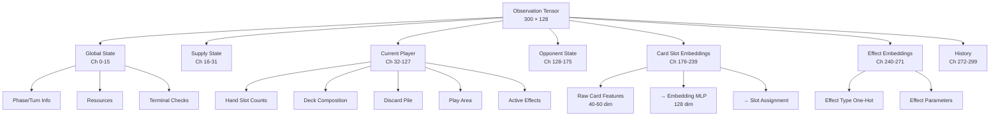

# Dominion Observation Tensor Design Document v2.0

## Executive Summary

This document proposes a comprehensive observation tensor design for the Dominion deck-building game, suitable for AlphaZero reinforcement learning training. **Version 2.0** introduces a **transformer-based architecture** with **learnable card embeddings** to support 500+ distinct cards across all expansions while maintaining efficient slot-based tensor representation.

### Key Changes from v1.0
- **Tensor width increased to 128** (from 64) for dynamic slot allocation
- **Card Embedding MLP** converts fixed card features (40-60 dims) → 128-dim learnable embeddings
- **Attention-based Transformer** for slot allocation and card interaction modeling
- **Split architecture** with shared transformer encoder feeding separate Policy and Value heads
- **Enhanced OpenSpiel C++ integration** for maximum reusability

## 1. Design Philosophy

### 1.1 Core Principles

1. **Imperfect Information Fidelity**: The tensor represents only information available to the current player, matching Information State MCTS requirements
2. **Semantic Card Representation**: Cards encoded by properties and effects rather than just indices, enabling generalization
3. **Future-Proof Architecture**: Dynamic slot allocation supporting 500+ cards without tensor restructuring
4. **Learnable Embeddings**: Card Embedding MLP projects fixed features into task-relevant representation space
5. **Attention-Based Reasoning**: Transformer captures card-card interactions and strategic relationships
6. **Efficient Encoding**: Balance between richness and computational cost

### 1.2 Architectural Innovation

The key insight driving v2.0 is that **static card indexing doesn't scale**. With 500+ cards across expansions:
- Fixed tensor positions waste space (most cards unused in any game)
- Re-indexing breaks backward compatibility
- No mechanism to generalize to unseen cards

**Solution**: Attention-based slot allocation where:
- Each card is represented by its **semantic features** (cost, types, effects)
- A **learned embedding MLP** projects these to a common space
- **Transformer attention** assigns cards to slots and models interactions
- The resulting representation feeds **Policy and Value heads**

### 1.3 Inspiration from Related Work

| System | Technique | Adaptation for Dominion |
|--------|-----------|------------------------|
| **AlphaStar** | Entity embeddings + Transformer | Card embeddings + slot attention |
| **AlphaFold** | Pair representations via attention | Card-card synergy modeling |
| **Set Transformer** | Permutation-invariant set encoding | Kingdom card set encoding |
| **Decision Transformer** | Sequence modeling for RL | Action history encoding |

## 2. Observation Tensor Architecture

### 2.1 Overall Structure

```
┌─────────────────────────────────────────────────────────────────┐
│ Dominion Observation Tensor v2.0                                │
│ Shape: [NUM_CHANNELS, TENSOR_WIDTH=128]                         │
│ Total Size: ~38,400 values                                      │
├─────────────────────────────────────────────────────────────────┤
│ Section 1: Global Game State         [Channels   0-15]   (16)   │
│ Section 2: Supply State              [Channels  16-31]   (16)   │
│ Section 3: Current Player State      [Channels  32-127]  (96)   │
│ Section 4: Opponent State            [Channels 128-175]  (48)   │
│ Section 5: Card Slot Embeddings      [Channels 176-239]  (64)   │
│ Section 6: Effect State Embeddings   [Channels 240-271]  (32)   │
│ Section 7: Sequence History          [Channels 272-299]  (28)   │
└─────────────────────────────────────────────────────────────────┘
```

**Tensor Dimensions:**
- **Primary Shape**: `[300, 128]` = **38,400 values** (~154 KB per observation)
- **Slot Width**: 128 allows indexing up to 128 distinct card types per game
- **Channel Depth**: 300 channels provide rich feature encoding

### 2.2 Transformer-Augmented Architecture Overview

```
┌─────────────────────────────────────────────────────────────────┐
│                    NEURAL NETWORK ARCHITECTURE                   │
├─────────────────────────────────────────────────────────────────┤
│                                                                  │
│  ┌──────────────┐     ┌──────────────┐     ┌──────────────┐     │
│  │ Card Features│     │ Card Features│     │ Card Features│     │
│  │  (40-60 dim) │     │  (40-60 dim) │     │  (40-60 dim) │     │
│  │   Card #1    │     │   Card #2    │     │   Card #N    │     │
│  └──────┬───────┘     └──────┬───────┘     └──────┬───────┘     │
│         │                    │                    │              │
│         ▼                    ▼                    ▼              │
│  ┌─────────────────────────────────────────────────────────┐    │
│  │              CARD EMBEDDING MLP (Shared)                 │    │
│  │              Input: 40-60 dim → Output: 128 dim          │    │
│  └─────────────────────────────────────────────────────────┘    │
│         │                    │                    │              │
│         ▼                    ▼                    ▼              │
│  ┌─────────────────────────────────────────────────────────┐    │
│  │         CARD EMBEDDINGS [N_cards × 128]                  │    │
│  │         + Positional Slot Encodings                      │    │
│  └─────────────────────────────────────────────────────────┘    │
│                            │                                     │
│                            ▼                                     │
│  ┌─────────────────────────────────────────────────────────┐    │
│  │           ATTENTION TRANSFORMER ENCODER                  │    │
│  │  ┌─────────────────────────────────────────────────┐    │    │
│  │  │  Multi-Head Self-Attention (Card Interactions)  │    │    │
│  │  └─────────────────────────────────────────────────┘    │    │
│  │  ┌─────────────────────────────────────────────────┐    │    │
│  │  │  Feed-Forward Network + Layer Norm              │    │    │
│  │  └─────────────────────────────────────────────────┘    │    │
│  │  ┌─────────────────────────────────────────────────┐    │    │
│  │  │  Cross-Attention with Game State Context        │    │    │
│  │  └─────────────────────────────────────────────────┘    │    │
│  └─────────────────────────────────────────────────────────┘    │
│                            │                                     │
│              ┌─────────────┴─────────────┐                      │
│              ▼                           ▼                       │
│  ┌────────────────────┐     ┌────────────────────┐              │
│  │    POLICY HEAD     │     │    VALUE HEAD      │              │
│  │   (Action MLP)     │     │   (Scalar MLP)     │              │
│  │                    │     │                    │              │
│  │  Output: Action    │     │  Output: V(s)      │              │
│  │  Probabilities     │     │  ∈ [-1, 1]         │              │
│  └────────────────────┘     └────────────────────┘              │
│                                                                  │
└─────────────────────────────────────────────────────────────────┘
```

### 2.3 Section Breakdown



## 3. Card Embedding System

### 3.1 Fixed Card Feature Vector (Input to Embedding MLP)

Each card is represented by a **fixed feature vector** capturing its intrinsic properties. This is **domain knowledge** that doesn't change during training.

```cpp
// Card feature vector structure: 48 dimensions
struct CardFeatureVector {
  // === Basic Properties (8 dims) ===
  float cost_normalized;           // cost / 10.0
  float potion_cost;               // 0 or 1 (Alchemy)
  float debt_cost_normalized;      // debt / 10.0 (Empires)
  float treasure_value_normalized; // value / 5.0
  float vp_value_normalized;       // vp / 10.0
  float is_supply_pile;            // 1 if gainable from supply
  float is_kingdom_card;           // 1 if kingdom pile
  float pile_size_normalized;      // initial_pile_size / 12.0
  
  // === Type Flags (12 dims) ===
  float is_treasure;
  float is_action;
  float is_victory;
  float is_curse;
  float is_attack;
  float is_reaction;
  float is_duration;               // Seaside, etc.
  float is_reserve;                // Adventures
  float is_night;                  // Nocturne
  float is_command;                // Future-proof
  float is_liaison;                // Allies
  float is_loot;                   // Plunder
  
  // === Grant Properties (8 dims) ===
  float grant_actions_normalized;  // +Actions / 5.0
  float grant_cards_normalized;    // +Cards / 5.0
  float grant_buys_normalized;     // +Buys / 3.0
  float grant_coins_normalized;    // +Coins / 5.0
  float grant_villagers;           // Renaissance
  float grant_coffers;             // Renaissance
  float grant_favors;              // Allies
  float grant_exile;               // Menagerie
  
  // === Effect Flags (16 dims) ===
  float has_on_play_effect;
  float has_on_gain_effect;
  float has_on_trash_effect;
  float has_when_discard_effect;
  float effect_targets_self;
  float effect_targets_others;
  float effect_involves_discard;
  float effect_involves_trash;
  float effect_involves_gain;
  float effect_involves_draw;
  float effect_involves_reveal;
  float effect_involves_deck_order;
  float effect_is_terminal;        // No +Actions
  float effect_is_cantrip;         // +1 Card, +1 Action
  float effect_is_village;         // +2 Actions or more
  float effect_is_smithy;          // +3 Cards or more
  
  // === Interaction Tags (4 dims) ===
  float synergy_with_actions;      // Benefits from more actions
  float synergy_with_treasure;     // Benefits from treasure
  float synergy_with_trashing;     // Benefits from thin deck
  float synergy_with_gaining;      // Benefits from gains
  
  // Total: 48 dimensions
  static constexpr int kFeatureDim = 48;
};
```

### 3.2 Card Embedding MLP Architecture

The embedding MLP projects fixed features into a **learnable 128-dimensional space**.

```cpp
// Card Embedding MLP: 48 → 128 dimensions
class CardEmbeddingMLP {
 public:
  static constexpr int kInputDim = CardFeatureVector::kFeatureDim;  // 48
  static constexpr int kHiddenDim = 96;
  static constexpr int kOutputDim = 128;
  
  // Architecture:
  // Linear(48 → 96) → LayerNorm → GELU → 
  // Linear(96 → 96) → LayerNorm → GELU →
  // Linear(96 → 128) → LayerNorm
  
  struct Config {
    int input_dim = kInputDim;
    int hidden_dim = kHiddenDim;
    int output_dim = kOutputDim;
    int num_layers = 3;
    float dropout = 0.1f;
    bool use_layer_norm = true;
  };
  
  Eigen::VectorXf Forward(const CardFeatureVector& features) const;
  
  // Batch processing for efficiency
  Eigen::MatrixXf ForwardBatch(
    const std::vector<CardFeatureVector>& features) const;
    
 private:
  // Weights (learned during training)
  Eigen::MatrixXf W1_, W2_, W3_;
  Eigen::VectorXf b1_, b2_, b3_;
  // Layer norm parameters
  Eigen::VectorXf gamma1_, beta1_, gamma2_, beta2_, gamma3_, beta3_;
};
```

### 3.3 Slot Assignment via Attention

The transformer's attention mechanism assigns each card to slots in the tensor.

```cpp
// Slot assignment structure
struct SlotAssignment {
  // Maps CardName → slot index [0, 127]
  std::array<int, 512> card_to_slot;  // Support 512 cards
  
  // Maps slot index → CardName (inverse)
  std::array<CardName, 128> slot_to_card;
  
  // Number of active slots in current game
  int num_active_slots;
  
  // Attention weights for interpretability
  Eigen::MatrixXf attention_weights;  // [num_cards, 128]
};

class SlotAllocator {
 public:
  // Compute slot assignments for current kingdom
  SlotAssignment ComputeSlots(
    const std::vector<CardName>& kingdom_cards,
    const CardEmbeddingMLP& embedding_mlp,
    const TransformerEncoder& encoder);
    
  // Get slot index for a card (runtime lookup)
  int GetSlot(CardName card) const;
  
  // Get card at slot (inverse lookup)
  CardName GetCard(int slot) const;
  
 private:
  SlotAssignment current_assignment_;
  
  // Positional encodings for slots
  Eigen::MatrixXf positional_encodings_;  // [128, 128]
};
```

## 4. Attention Transformer Architecture

### 4.1 Transformer Encoder Design

```cpp
class DominionTransformerEncoder {
 public:
  struct Config {
    int d_model = 128;          // Embedding dimension
    int n_heads = 8;            // Attention heads
    int n_layers = 4;           // Transformer layers
    int d_ff = 512;             // Feed-forward hidden dim
    float dropout = 0.1f;
    int max_slots = 128;        // Maximum card slots
    bool use_relative_pos = true;
  };
  
  // Forward pass: card embeddings → contextualized representations
  // Input:  [batch, num_cards, 128]
  // Output: [batch, num_cards, 128]
  Eigen::Tensor<float, 3> Forward(
    const Eigen::Tensor<float, 3>& card_embeddings,
    const Eigen::Tensor<float, 3>& game_state_context,
    const Eigen::Tensor<bool, 2>& attention_mask);
    
 private:
  std::vector<TransformerLayer> layers_;
  LayerNorm final_norm_;
  PositionalEncoding pos_encoding_;
};

class TransformerLayer {
 public:
  // Self-attention for card-card interactions
  MultiHeadAttention self_attention_;
  
  // Cross-attention with game state (optional)
  MultiHeadAttention cross_attention_;
  
  // Feed-forward network
  FeedForward ffn_;
  
  // Layer normalizations
  LayerNorm norm1_, norm2_, norm3_;
  
  Eigen::MatrixXf Forward(
    const Eigen::MatrixXf& x,
    const Eigen::MatrixXf& context,
    const Eigen::VectorXf& mask);
};
```

### 4.2 Multi-Head Attention Implementation

```cpp
class MultiHeadAttention {
 public:
  struct Config {
    int d_model = 128;
    int n_heads = 8;
    int d_k = 16;  // d_model / n_heads
    int d_v = 16;
    float dropout = 0.1f;
  };
  
  // Q, K, V projections
  // Attention(Q, K, V) = softmax(QK^T / sqrt(d_k)) V
  Eigen::MatrixXf Forward(
    const Eigen::MatrixXf& query,
    const Eigen::MatrixXf& key,
    const Eigen::MatrixXf& value,
    const Eigen::VectorXf& mask = {});
    
  // Get attention weights for interpretability
  Eigen::MatrixXf GetAttentionWeights() const { return attention_weights_; }
  
 private:
  Eigen::MatrixXf Wq_, Wk_, Wv_, Wo_;
  Eigen::MatrixXf attention_weights_;
  Config config_;
};
```

### 4.3 Policy and Value Head Split

```cpp
class PolicyValueHeads {
 public:
  struct Config {
    int transformer_dim = 128;
    int policy_hidden_dim = 256;
    int value_hidden_dim = 256;
    int num_actions;  // Game-dependent
  };
  
  // Policy head: transformer output → action probabilities
  // Uses attention pooling over card representations
  class PolicyHead {
   public:
    // Input: [num_cards, 128] contextualized card embeddings
    // Output: [num_actions] action logits
    Eigen::VectorXf Forward(
      const Eigen::MatrixXf& transformer_output,
      const Eigen::VectorXf& game_state_features);
      
   private:
    // Attention pooling to aggregate card representations
    Eigen::VectorXf AttentionPool(const Eigen::MatrixXf& cards);
    
    // MLP: pooled → action logits
    Eigen::MatrixXf W1_, W2_, W3_;
    Eigen::VectorXf b1_, b2_, b3_;
  };
  
  // Value head: transformer output → scalar value
  class ValueHead {
   public:
    // Input: [num_cards, 128] contextualized card embeddings
    // Output: scalar in [-1, 1]
    float Forward(
      const Eigen::MatrixXf& transformer_output,
      const Eigen::VectorXf& game_state_features);
      
   private:
    // Attention pooling
    Eigen::VectorXf AttentionPool(const Eigen::MatrixXf& cards);
    
    // MLP: pooled → scalar
    Eigen::MatrixXf W1_, W2_, W3_;
    Eigen::VectorXf b1_, b2_, b3_;
  };
  
  PolicyHead policy_head_;
  ValueHead value_head_;
};
```

## 5. Detailed Tensor Channel Encoding

### 5.1 Global Game State (Channels 0-15)

```cpp
// Channel 0-1: Phase and Turn Metadata
// Width: 128
Channel[0][0:2]   = current_player_one_hot;      // [1,0] or [0,1]
Channel[0][2:4]   = phase_one_hot;               // actionPhase/buyPhase
Channel[0][4]     = turn_number / 100.0f;        // Normalized
Channel[0][5]     = game_progress;               // provinces_taken / 8.0f
Channel[0][6]     = empty_piles_count / 10.0f;
Channel[0][7:128] = 0;                           // Padding

// Channel 1: Current Player Resources
Channel[1][0] = actions / 10.0f;
Channel[1][1] = buys / 10.0f;
Channel[1][2] = coins / 20.0f;
Channel[1][3] = effective_coins / 20.0f;  // Including treasure in hand
Channel[1][4] = potions / 5.0f;           // Alchemy
Channel[1][5] = debt / 20.0f;             // Empires
Channel[1][6] = villagers / 10.0f;        // Renaissance
Channel[1][7] = coffers / 10.0f;          // Renaissance
Channel[1][8:128] = 0;                    // Padding

// Channels 2-3: Terminal Condition Checks
Channel[2][0] = provinces_remaining / 8.0f;
Channel[2][1] = colonies_remaining / 8.0f;  // Prosperity
Channel[2][2] = is_terminal ? 1.0f : 0.0f;
Channel[2][3:20] = empty_pile_flags;        // Binary for each supply pile
Channel[2][20:128] = 0;

// Channels 4-15: Reserved for future global features
// - Events/Landmarks/Projects state
// - Ally bonuses
// - Journey token positions
```

### 5.2 Supply State (Channels 16-31)

```cpp
// Channel 16-17: Supply Counts (Slot-Indexed)
// Each position i corresponds to slot i, NOT CardName enum
// The SlotAllocator maps CardName → slot index

Channel[16][slot_idx] = supply_pile_count[card_at_slot] / max_pile_size;

// Channel 18-19: Supply Availability and Affordability
Channel[18][slot_idx] = (supply_count > 0) ? 1.0f : 0.0f;
Channel[19][slot_idx] = (effective_coins >= card_cost) ? 1.0f : 0.0f;

// Channel 20-23: Supply Card Properties (Aggregated)
Channel[20][slot_idx] = card_cost_at_slot / 10.0f;
Channel[21][slot_idx] = card_is_action_at_slot;
Channel[22][slot_idx] = card_is_treasure_at_slot;
Channel[23][slot_idx] = card_is_victory_at_slot;

// Channels 24-31: Reserved for supply features
// - Embargo tokens
// - Trade route tokens
// - Pile-specific states
```

### 5.3 Current Player State (Channels 32-127)

#### 5.3.1 Hand Representation (Channels 32-55)

```cpp
// Channel 32-33: Hand Counts (Slot-Indexed)
Channel[32][slot_idx] = hand_count[card_at_slot] / max_hand_size;

// Channel 34-35: Hand Types Aggregation
Channel[34][0] = total_treasures_in_hand / 10.0f;
Channel[34][1] = total_actions_in_hand / 10.0f;
Channel[34][2] = total_victories_in_hand / 5.0f;
Channel[34][3] = total_hand_size / 20.0f;
Channel[34][4] = unique_card_types_in_hand / 20.0f;

// Channels 36-43: Hand Property Aggregates
Channel[36][0] = sum_cost_in_hand / 50.0f;
Channel[37][0] = sum_actions_grantable / 20.0f;
Channel[38][0] = sum_draws_grantable / 20.0f;
Channel[39][0] = sum_buys_grantable / 10.0f;
Channel[40][0] = sum_coins_grantable / 30.0f;
Channel[41][0] = avg_cost_in_hand / 10.0f;
Channel[42][0] = has_action_in_hand ? 1.0f : 0.0f;
Channel[43][0] = has_terminal_in_hand ? 1.0f : 0.0f;

// Channels 44-47: Playability Flags (Slot-Indexed)
// Which cards can legally be played right now
Channel[44][slot_idx] = can_play_card_at_slot ? 1.0f : 0.0f;
Channel[45][slot_idx] = is_selected_for_effect[slot_idx];

// Channels 48-55: Reserved for hand features
```

#### 5.3.2 Deck Representation (Channels 56-71)

```cpp
// Deck order is HIDDEN - only composition is encoded

// Channel 56-57: Deck Composition (Slot-Indexed)
Channel[56][slot_idx] = deck_count[card_at_slot] / deck_size;

// Channel 58-59: Deck Aggregates
Channel[58][0] = total_deck_size / 60.0f;
Channel[58][1] = treasure_density;  // treasure_count / deck_size
Channel[58][2] = action_density;
Channel[58][3] = victory_density;
Channel[58][4] = avg_card_cost_in_deck / 10.0f;
Channel[58][5] = deck_total_vp / 50.0f;

// Channels 60-63: Deck Property Aggregates (similar to hand)
Channel[60][0] = sum_deck_actions_grantable / 30.0f;
Channel[61][0] = sum_deck_draws_grantable / 30.0f;
Channel[62][0] = sum_deck_coins_grantable / 50.0f;
Channel[63][0] = estimated_draw_quality;  // Expected value of next draw

// Channels 64-71: Reserved
```

#### 5.3.3 Discard Pile (Channels 72-87)

```cpp
// Discard is public information - full composition visible

// Channel 72-73: Discard Counts (Slot-Indexed)
Channel[72][slot_idx] = discard_count[card_at_slot] / discard_size;

// Channel 74-75: Discard Aggregates
Channel[74][0] = total_discard_size / 60.0f;
Channel[74][1] = treasure_in_discard / 20.0f;
Channel[74][2] = action_in_discard / 20.0f;
Channel[74][3] = victory_in_discard / 10.0f;

// Channel 76-79: Reshuffle Analysis
// When deck empties, discard becomes new deck - this matters!
Channel[76][0] = turns_until_reshuffle_estimate;
Channel[76][1] = cards_until_reshuffle / 20.0f;
Channel[76][2] = post_reshuffle_action_density;
Channel[76][3] = post_reshuffle_treasure_density;

// Channels 80-87: Reserved
```

#### 5.3.4 Play Area (Channels 88-95)

```cpp
// Channel 88-89: Play Area Counts (Slot-Indexed)
Channel[88][slot_idx] = play_area_count[card_at_slot] / 10.0f;

// Channel 90-91: Play Area Aggregates
Channel[90][0] = total_cards_in_play / 20.0f;
Channel[90][1] = actions_played_this_turn / 10.0f;
Channel[90][2] = treasures_played_this_turn / 10.0f;
Channel[90][3] = duration_cards_in_play / 5.0f;

// Channels 92-95: Reserved
```

#### 5.3.5 Active Effects State (Channels 96-111)

```cpp
// Channel 96-97: Effect Queue State
Channel[96][0] = has_pending_effect ? 1.0f : 0.0f;
Channel[96][1] = effect_queue_depth / 5.0f;
Channel[96][2:7] = pending_choice_one_hot;  // None/Discard/Trash/Play/Gain
Channel[96][7] = is_opponent_turn_for_effect ? 1.0f : 0.0f;

// Channel 98-99: Current Effect Details
Channel[98][0] = effect_target_hand_size / 10.0f;  // Militia
Channel[98][1] = effect_max_cost / 10.0f;          // Workshop/Remodel
Channel[98][2] = effect_selection_count / 10.0f;
Channel[98][3] = effect_max_selections / 10.0f;
Channel[98][4] = throne_depth / 5.0f;
Channel[98][5] = effect_allows_finish ? 1.0f : 0.0f;

// Channels 100-103: Effect Source Card (Slot-Indexed)
// One-hot indicating which card created this effect
Channel[100][slot_idx] = (effect_source_card == card_at_slot) ? 1.0f : 0.0f;

// Channels 104-107: Legal Selections (Slot-Indexed)
// Which cards can be selected for current effect
Channel[104][slot_idx] = can_select_for_discard[slot_idx];
Channel[105][slot_idx] = can_select_for_trash[slot_idx];
Channel[106][slot_idx] = can_select_for_gain[slot_idx];
Channel[107][slot_idx] = can_select_for_play[slot_idx];

// Channels 108-111: Reserved for effect state
```

#### 5.3.6 Total Collection Stats (Channels 112-127)

```cpp
// Channel 112-113: Total Collection (Deck + Hand + Discard)
Channel[112][slot_idx] = total_owned[card_at_slot] / 10.0f;

// Channel 114-117: Victory Point Calculations
Channel[114][0] = current_vp_estimate / 50.0f;
Channel[114][1] = gardens_vp_contribution / 10.0f;
Channel[114][2] = duchies_vp_contribution / 15.0f;
Channel[114][3] = provinces_vp_contribution / 30.0f;
Channel[114][4] = total_owned_cards / 60.0f;  // For Gardens
Channel[114][5] = vp_from_curses / 10.0f;     // Negative

// Channel 118-119: Deck Quality Metrics
Channel[118][0] = avg_card_quality;           // Learned metric
Channel[118][1] = action_density_overall;
Channel[118][2] = treasure_density_overall;
Channel[118][3] = payload_ratio;              // Non-green cards
Channel[118][4] = estimated_turns_remaining / 20.0f;

// Channels 120-127: Reserved
```

### 5.4 Opponent State (Channels 128-175)

**Imperfect Information**: Only publicly visible or inferrable data.

```cpp
// Channel 128-129: Opponent Zone Sizes
Channel[128][0] = opponent_hand_size / 20.0f;
Channel[128][1] = opponent_deck_size / 60.0f;
Channel[128][2] = opponent_discard_size / 60.0f;
Channel[128][3] = opponent_total_cards / 60.0f;
Channel[128][4] = opponent_cards_in_play / 10.0f;

// Channel 130-131: Opponent Known Cards (Slot-Indexed)
// Cards revealed through attacks, gains, etc.
Channel[130][slot_idx] = known_opponent_card_count[slot_idx] / 10.0f;

// Channel 132-135: Opponent Aggregates
Channel[132][0] = opponent_estimated_vp / 50.0f;
Channel[132][1] = opponent_provinces_owned / 8.0f;
Channel[132][2] = opponent_duchies_owned / 8.0f;
Channel[132][3] = opponent_curses_owned / 10.0f;
Channel[132][4] = opponent_gardens_owned / 10.0f;

// Channel 136-139: Opponent Resource Estimates
Channel[136][0] = opponent_estimated_treasure_density;
Channel[136][1] = opponent_estimated_action_density;
Channel[136][2] = opponent_last_known_coins / 20.0f;
Channel[136][3] = opponent_buys_this_turn / 5.0f;

// Channel 140-143: Opponent Turn Information
Channel[140][0] = opponent_actions_this_turn / 10.0f;
Channel[140][1] = opponent_cards_drawn_this_turn / 10.0f;
Channel[140][2] = opponent_cards_gained_this_turn / 5.0f;

// Channels 144-175: Reserved for opponent modeling
// - Attack history
// - Revealed cards from reactions
// - Strategy estimation
```

### 5.5 Card Slot Embeddings (Channels 176-239)

These channels contain the **output of the Card Embedding MLP** for each slot.

```cpp
// The embedding MLP output is placed directly in the tensor
// This allows the neural network to access learned card representations

// Channel 176-239: Card Embeddings (64 channels × 128 width)
// For each slot s ∈ [0, 127]:
//   Channel[176 + (dim // 2)][s] contains embedding dimension dim
// 
// This packs 128-dim embeddings into 64 channels, 2 dims per channel

for (int slot = 0; slot < 128; ++slot) {
  CardName card = slot_to_card[slot];
  if (card != CardName::NONE) {
    Eigen::VectorXf embedding = embedding_mlp.Forward(GetFeatures(card));
    for (int d = 0; d < 128; ++d) {
      int channel = 176 + (d / 2);
      int position = slot;  // Interleaved storage
      // Pack 2 embedding dims per channel row
      Channel[channel][position * 2 + (d % 2)] = embedding[d];
    }
  }
}

// Alternative: Full 128 channels for embeddings (channels 176-303)
// Simpler but uses more space
for (int slot = 0; slot < 128; ++slot) {
  Eigen::VectorXf embedding = embedding_mlp.Forward(GetFeatures(card));
  for (int d = 0; d < 128; ++d) {
    Channel[176 + d][slot] = embedding[d];
  }
}
```

### 5.6 Effect State Embeddings (Channels 240-271)

```cpp
// Channel 240-247: Effect Type Encoding
// One-hot + multi-hot for active effects
Channel[240][0:16] = effect_type_one_hot;      // Current effect type
Channel[241][0:16] = pending_effects_multi_hot; // All queued effects

// Channel 248-255: Effect Parameters (Per-Effect-Type)
// Cellar parameters
Channel[248][0] = cellar_cards_discarded / 10.0f;
Channel[248][1] = cellar_cards_to_draw / 10.0f;

// Chapel parameters  
Channel[249][0] = chapel_cards_trashed / 4.0f;
Channel[249][1] = chapel_max_trash / 4.0f;

// Workshop/Remodel parameters
Channel[250][0] = gain_max_cost / 10.0f;
Channel[250][1] = trashed_card_cost / 10.0f;

// Militia parameters
Channel[251][0] = militia_target_hand_size / 10.0f;
Channel[251][1] = cards_discarded_so_far / 5.0f;

// Throne Room parameters
Channel[252][0] = throne_depth / 5.0f;
Channel[252][1] = plays_remaining / 5.0f;
Channel[252][2] = target_card_slot / 128.0f;

// Channels 256-271: Reserved for complex effect states
// - Duration effect tracking
// - Reaction chains
// - Multi-stage effects (e.g., Sentry)
```

### 5.7 Sequence History (Channels 272-299)

```cpp
// Channel 272-279: Last N Actions (N=8)
// Each action encoded as: [action_type, card_slot, target_slot, modifier]
for (int i = 0; i < 8; ++i) {
  if (i < action_history.size()) {
    const auto& action = action_history[action_history.size() - 1 - i];
    Channel[272 + i][0] = action.type_normalized;        // Play/Buy/Discard/etc
    Channel[272 + i][1] = action.card_slot / 128.0f;
    Channel[272 + i][2] = action.target_slot / 128.0f;   // For effects
    Channel[272 + i][3] = action.cost_paid / 10.0f;
    Channel[272 + i][4] = action.turn_number / 100.0f;
    Channel[272 + i][5] = action.was_success ? 1.0f : 0.0f;
  }
}

// Channel 280-283: Last N Cards Gained (N=4)
for (int i = 0; i < 4; ++i) {
  if (i < gain_history.size()) {
    Channel[280 + i][0] = gain_history[i].card_slot / 128.0f;
    Channel[280 + i][1] = gain_history[i].cost / 10.0f;
    Channel[280 + i][2] = gain_history[i].was_bought ? 1.0f : 0.0f;
    Channel[280 + i][3] = gain_history[i].turn_number / 100.0f;
  }
}

// Channel 284-287: Turn Statistics History (Last 4 Turns)
for (int i = 0; i < 4; ++i) {
  Channel[284 + i][0] = turn_history[i].actions_played / 10.0f;
  Channel[284 + i][1] = turn_history[i].cards_drawn / 10.0f;
  Channel[284 + i][2] = turn_history[i].cards_bought / 5.0f;
  Channel[284 + i][3] = turn_history[i].coins_spent / 20.0f;
  Channel[284 + i][4] = turn_history[i].vp_gained / 10.0f;
}

// Channel 288-291: Opponent Action History (Last 4)
// Public information from opponent's turn

// Channels 292-299: Reserved for history features
```

## 6. OpenSpiel C++ Integration

### 6.1 Core Integration Points

```cpp
// File: dominion_observation.hpp
#ifndef OPEN_SPIEL_GAMES_DOMINION_OBSERVATION_H_
#define OPEN_SPIEL_GAMES_DOMINION_OBSERVATION_H_

#include "open_spiel/spiel.h"
#include "open_spiel/spiel_utils.h"
#include "open_spiel/tensor_view.h"
#include "dominion.hpp"

namespace open_spiel {
namespace dominion {

// Constants for tensor dimensions
inline constexpr int kObservationNumChannels = 300;
inline constexpr int kObservationTensorWidth = 128;
inline constexpr int kObservationTensorSize = 
    kObservationNumChannels * kObservationTensorWidth;

// Card feature dimensions
inline constexpr int kCardFeatureDim = 48;
inline constexpr int kCardEmbeddingDim = 128;

// Forward declarations
class CardFeatureDatabase;
class SlotAllocator;

// Main observation encoder class
class DominionObservationEncoder {
 public:
  DominionObservationEncoder();
  
  // Primary encoding interface (matches OpenSpiel pattern)
  void Encode(const DominionState& state, 
              Player player,
              absl::Span<float> values) const;
  
  // Get tensor shape for OpenSpiel registration
  static std::vector<int> Shape() {
    return {kObservationNumChannels, kObservationTensorWidth};
  }
  
  // Get slot for a card in current game
  int GetCardSlot(CardName card) const;
  
  // Get card at slot
  CardName GetCardAtSlot(int slot) const;
  
 private:
  void EncodeGlobalState(const DominionState& state, 
                         absl::Span<float> values) const;
  void EncodeSupplyState(const DominionState& state,
                         absl::Span<float> values) const;
  void EncodePlayerState(const DominionState& state,
                         Player player,
                         absl::Span<float> values) const;
  void EncodeOpponentState(const DominionState& state,
                           Player player,
                           absl::Span<float> values) const;
  void EncodeCardEmbeddings(const DominionState& state,
                            absl::Span<float> values) const;
  void EncodeEffectState(const DominionState& state,
                         Player player,
                         absl::Span<float> values) const;
  void EncodeHistory(const DominionState& state,
                     Player player,
                     absl::Span<float> values) const;
  
  // Slot allocation for current game
  mutable SlotAllocator slot_allocator_;
  
  // Card feature database (shared, const)
  std::shared_ptr<const CardFeatureDatabase> card_db_;
};

}  // namespace dominion
}  // namespace open_spiel

#endif
```

### 6.2 DominionGame Integration

```cpp
// Additions to DominionGame class in dominion.hpp

class DominionGame : public Game {
 public:
  // ... existing methods ...
  
  // Observation tensor support (OpenSpiel interface)
  std::vector<int> ObservationTensorShape() const override {
    return DominionObservationEncoder::Shape();
  }
  
  std::vector<int> InformationStateTensorShape() const override {
    // Information state includes full observation + hidden info
    // For imperfect info games, this may differ from observation
    return DominionObservationEncoder::Shape();  // Same for now
  }
  
  // Optional: observation config
  struct ObservationConfig {
    bool include_history = true;
    bool include_embeddings = true;
    int history_length = 8;
  };
  
  void SetObservationConfig(const ObservationConfig& config);
  
 private:
  ObservationConfig obs_config_;
};
```

### 6.3 DominionState Integration

```cpp
// Additions to DominionState class in dominion.hpp

class DominionState : public State {
 public:
  // ... existing methods ...
  
  // Observation tensor generation (OpenSpiel interface)
  void ObservationTensor(Player player, 
                         absl::Span<float> values) const override {
    encoder_.Encode(*this, player, values);
  }
  
  // Information state tensor (may include more data)
  void InformationStateTensor(Player player,
                              absl::Span<float> values) const override {
    // For now, same as observation
    ObservationTensor(player, values);
  }
  
  // History tracking (for sequence encoding)
  void RecordAction(Action action, Player player);
  void RecordGain(CardName card, Player player, bool was_bought);
  
  const std::deque<ActionRecord>& GetActionHistory(Player player) const {
    return player_states_[player].action_history_;
  }
  
 private:
  mutable DominionObservationEncoder encoder_;
  
  // History tracking in PlayerState
  struct ActionRecord {
    Action action;
    CardName card;
    int target_slot;
    int turn_number;
    bool was_success;
  };
};
```

### 6.4 Card Feature Database

```cpp
// File: card_feature_database.hpp

namespace open_spiel {
namespace dominion {

class CardFeatureDatabase {
 public:
  // Singleton access
  static const CardFeatureDatabase& Instance();
  
  // Get feature vector for a card
  const CardFeatureVector& GetFeatures(CardName card) const;
  
  // Get all registered cards
  std::vector<CardName> GetAllCards() const;
  
  // Check if card is registered
  bool HasCard(CardName card) const;
  
  // Register a new card (for expansion support)
  void RegisterCard(CardName card, const CardFeatureVector& features);
  
  // Compute feature vector from Card spec (automatic)
  static CardFeatureVector ComputeFeatures(const Card& card);
  
 private:
  CardFeatureDatabase();
  void InitializeBaseSet();
  void InitializeIntrigue();
  void InitializeSeaside();
  // ... other expansions ...
  
  absl::flat_hash_map<CardName, CardFeatureVector> features_;
};

// Feature vector computation from Card specification
CardFeatureVector CardFeatureDatabase::ComputeFeatures(const Card& card) {
  CardFeatureVector f;
  
  // Basic properties
  f.cost_normalized = card.cost_ / 10.0f;
  f.treasure_value_normalized = card.value_ / 5.0f;
  f.vp_value_normalized = card.vp_ / 10.0f;
  
  // Type flags
  f.is_treasure = card.IsTreasure() ? 1.0f : 0.0f;
  f.is_action = card.IsAction() ? 1.0f : 0.0f;
  f.is_victory = card.IsVictory() ? 1.0f : 0.0f;
  f.is_attack = card.IsAttack() ? 1.0f : 0.0f;
  
  // Grant properties
  f.grant_actions_normalized = card.grant_action_ / 5.0f;
  f.grant_cards_normalized = card.grant_draw_ / 5.0f;
  f.grant_buys_normalized = card.grant_buy_ / 3.0f;
  f.grant_coins_normalized = card.value_ / 5.0f;
  
  // Effect flags (derived from has_unique_effect_ and card behavior)
  f.has_on_play_effect = card.has_unique_effect_ ? 1.0f : 0.0f;
  f.effect_is_terminal = (card.IsAction() && card.grant_action_ == 0) ? 1.0f : 0.0f;
  f.effect_is_cantrip = (card.grant_draw_ >= 1 && card.grant_action_ >= 1) ? 1.0f : 0.0f;
  f.effect_is_village = (card.grant_action_ >= 2) ? 1.0f : 0.0f;
  f.effect_is_smithy = (card.grant_draw_ >= 3) ? 1.0f : 0.0f;
  
  return f;
}

}  // namespace dominion
}  // namespace open_spiel
```

### 6.5 Slot Allocator

```cpp
// File: slot_allocator.hpp

namespace open_spiel {
namespace dominion {

class SlotAllocator {
 public:
  SlotAllocator();
  
  // Initialize slot mapping for a game's kingdom
  void Initialize(const std::array<int, kNumSupplyPiles>& initial_supply);
  
  // Get slot for a card (O(1) lookup)
  int GetSlot(CardName card) const {
    int idx = static_cast<int>(card);
    SPIEL_CHECK_GE(idx, 0);
    SPIEL_CHECK_LT(idx, card_to_slot_.size());
    return card_to_slot_[idx];
  }
  
  // Get card at slot (O(1) lookup)
  CardName GetCard(int slot) const {
    SPIEL_CHECK_GE(slot, 0);
    SPIEL_CHECK_LT(slot, kObservationTensorWidth);
    return slot_to_card_[slot];
  }
  
  // Get number of active slots
  int NumActiveSlots() const { return num_active_slots_; }
  
  // Check if slot is active
  bool IsSlotActive(int slot) const {
    return slot >= 0 && slot < num_active_slots_;
  }
  
 private:
  // CardName enum value → slot index
  std::array<int, 512> card_to_slot_;  // Support up to 512 cards
  
  // Slot index → CardName
  std::array<CardName, kObservationTensorWidth> slot_to_card_;
  
  // Number of slots actually used
  int num_active_slots_ = 0;
  
  // Allocation strategy: sorted by CardName for consistency
  void AllocateSlots(const std::vector<CardName>& cards);
};

void SlotAllocator::Initialize(
    const std::array<int, kNumSupplyPiles>& initial_supply) {
  // Reset
  card_to_slot_.fill(-1);
  slot_to_card_.fill(static_cast<CardName>(-1));
  num_active_slots_ = 0;
  
  // Collect all cards that exist in this game
  std::vector<CardName> active_cards;
  for (int i = 0; i < kNumSupplyPiles; ++i) {
    if (initial_supply[i] > 0) {
      active_cards.push_back(static_cast<CardName>(i));
    }
  }
  
  // Sort for deterministic ordering
  std::sort(active_cards.begin(), active_cards.end());
  
  // Allocate slots
  AllocateSlots(active_cards);
}

void SlotAllocator::AllocateSlots(const std::vector<CardName>& cards) {
  // Simple sequential allocation
  // Could be enhanced with learned clustering via attention
  for (size_t i = 0; i < cards.size() && i < kObservationTensorWidth; ++i) {
    int slot = static_cast<int>(i);
    CardName card = cards[i];
    card_to_slot_[static_cast<int>(card)] = slot;
    slot_to_card_[slot] = card;
  }
  num_active_slots_ = std::min(static_cast<int>(cards.size()), 
                               kObservationTensorWidth);
}

}  // namespace dominion
}  // namespace open_spiel
```

## 7. Neural Network Architecture (PyTorch Reference)

### 7.1 Complete Network Architecture

```python
# File: dominion_network.py

import torch
import torch.nn as nn
import torch.nn.functional as F
import math

class CardEmbeddingMLP(nn.Module):
    """Projects fixed card features to learnable embeddings."""
    
    def __init__(self, 
                 input_dim: int = 48,
                 hidden_dim: int = 96,
                 output_dim: int = 128,
                 num_layers: int = 3,
                 dropout: float = 0.1):
        super().__init__()
        
        layers = []
        dims = [input_dim] + [hidden_dim] * (num_layers - 1) + [output_dim]
        
        for i in range(num_layers):
            layers.append(nn.Linear(dims[i], dims[i + 1]))
            if i < num_layers - 1:
                layers.append(nn.LayerNorm(dims[i + 1]))
                layers.append(nn.GELU())
                layers.append(nn.Dropout(dropout))
            else:
                layers.append(nn.LayerNorm(dims[i + 1]))
        
        self.mlp = nn.Sequential(*layers)
    
    def forward(self, card_features: torch.Tensor) -> torch.Tensor:
        """
        Args:
            card_features: [batch, num_cards, 48] fixed card features
        Returns:
            embeddings: [batch, num_cards, 128] learned embeddings
        """
        return self.mlp(card_features)


class PositionalEncoding(nn.Module):
    """Learnable positional encodings for card slots."""
    
    def __init__(self, d_model: int = 128, max_len: int = 128):
        super().__init__()
        self.pos_embedding = nn.Embedding(max_len, d_model)
    
    def forward(self, x: torch.Tensor) -> torch.Tensor:
        """
        Args:
            x: [batch, seq_len, d_model]
        Returns:
            x + positional encoding
        """
        batch_size, seq_len, _ = x.shape
        positions = torch.arange(seq_len, device=x.device)
        pos_enc = self.pos_embedding(positions)
        return x + pos_enc


class TransformerEncoderLayer(nn.Module):
    """Single transformer encoder layer with self-attention."""
    
    def __init__(self,
                 d_model: int = 128,
                 n_heads: int = 8,
                 d_ff: int = 512,
                 dropout: float = 0.1):
        super().__init__()
        
        self.self_attn = nn.MultiheadAttention(
            d_model, n_heads, dropout=dropout, batch_first=True
        )
        self.ffn = nn.Sequential(
            nn.Linear(d_model, d_ff),
            nn.GELU(),
            nn.Dropout(dropout),
            nn.Linear(d_ff, d_model),
            nn.Dropout(dropout)
        )
        self.norm1 = nn.LayerNorm(d_model)
        self.norm2 = nn.LayerNorm(d_model)
        self.dropout = nn.Dropout(dropout)
    
    def forward(self, 
                x: torch.Tensor, 
                mask: torch.Tensor = None) -> torch.Tensor:
        """
        Args:
            x: [batch, seq_len, d_model]
            mask: [batch, seq_len] attention mask (1=attend, 0=mask)
        Returns:
            output: [batch, seq_len, d_model]
        """
        # Self-attention with residual
        attn_out, _ = self.self_attn(x, x, x, key_padding_mask=~mask if mask is not None else None)
        x = self.norm1(x + self.dropout(attn_out))
        
        # Feed-forward with residual
        ffn_out = self.ffn(x)
        x = self.norm2(x + ffn_out)
        
        return x


class DominionTransformerEncoder(nn.Module):
    """Transformer encoder for card representations."""
    
    def __init__(self,
                 d_model: int = 128,
                 n_heads: int = 8,
                 n_layers: int = 4,
                 d_ff: int = 512,
                 max_slots: int = 128,
                 dropout: float = 0.1):
        super().__init__()
        
        self.pos_encoding = PositionalEncoding(d_model, max_slots)
        self.layers = nn.ModuleList([
            TransformerEncoderLayer(d_model, n_heads, d_ff, dropout)
            for _ in range(n_layers)
        ])
        self.final_norm = nn.LayerNorm(d_model)
    
    def forward(self, 
                card_embeddings: torch.Tensor,
                slot_mask: torch.Tensor = None) -> torch.Tensor:
        """
        Args:
            card_embeddings: [batch, num_slots, 128]
            slot_mask: [batch, num_slots] (1=active slot, 0=padding)
        Returns:
            contextualized: [batch, num_slots, 128]
        """
        x = self.pos_encoding(card_embeddings)
        
        for layer in self.layers:
            x = layer(x, slot_mask)
        
        return self.final_norm(x)


class AttentionPooling(nn.Module):
    """Attention-based pooling over slot representations."""
    
    def __init__(self, d_model: int = 128):
        super().__init__()
        self.attention_weights = nn.Linear(d_model, 1)
    
    def forward(self, 
                x: torch.Tensor, 
                mask: torch.Tensor = None) -> torch.Tensor:
        """
        Args:
            x: [batch, seq_len, d_model]
            mask: [batch, seq_len]
        Returns:
            pooled: [batch, d_model]
        """
        # Compute attention scores
        scores = self.attention_weights(x).squeeze(-1)  # [batch, seq_len]
        
        if mask is not None:
            scores = scores.masked_fill(~mask, float('-inf'))
        
        weights = F.softmax(scores, dim=-1)  # [batch, seq_len]
        pooled = torch.einsum('bs,bsd->bd', weights, x)
        
        return pooled


class PolicyHead(nn.Module):
    """Policy head for action probabilities."""
    
    def __init__(self,
                 d_model: int = 128,
                 game_state_dim: int = 64,
                 hidden_dim: int = 256,
                 num_actions: int = 4096):  # kDominionMaxDistinctActions
        super().__init__()
        
        self.attention_pool = AttentionPooling(d_model)
        
        self.mlp = nn.Sequential(
            nn.Linear(d_model + game_state_dim, hidden_dim),
            nn.LayerNorm(hidden_dim),
            nn.GELU(),
            nn.Linear(hidden_dim, hidden_dim),
            nn.LayerNorm(hidden_dim),
            nn.GELU(),
            nn.Linear(hidden_dim, num_actions)
        )
    
    def forward(self,
                transformer_output: torch.Tensor,
                game_state_features: torch.Tensor,
                slot_mask: torch.Tensor = None) -> torch.Tensor:
        """
        Args:
            transformer_output: [batch, num_slots, 128]
            game_state_features: [batch, 64] global game state
            slot_mask: [batch, num_slots]
        Returns:
            action_logits: [batch, num_actions]
        """
        pooled = self.attention_pool(transformer_output, slot_mask)
        combined = torch.cat([pooled, game_state_features], dim=-1)
        return self.mlp(combined)


class ValueHead(nn.Module):
    """Value head for state value estimation."""
    
    def __init__(self,
                 d_model: int = 128,
                 game_state_dim: int = 64,
                 hidden_dim: int = 256):
        super().__init__()
        
        self.attention_pool = AttentionPooling(d_model)
        
        self.mlp = nn.Sequential(
            nn.Linear(d_model + game_state_dim, hidden_dim),
            nn.LayerNorm(hidden_dim),
            nn.GELU(),
            nn.Linear(hidden_dim, hidden_dim),
            nn.LayerNorm(hidden_dim),
            nn.GELU(),
            nn.Linear(hidden_dim, 1),
            nn.Tanh()
        )
    
    def forward(self,
                transformer_output: torch.Tensor,
                game_state_features: torch.Tensor,
                slot_mask: torch.Tensor = None) -> torch.Tensor:
        """
        Args:
            transformer_output: [batch, num_slots, 128]
            game_state_features: [batch, 64] global game state
            slot_mask: [batch, num_slots]
        Returns:
            value: [batch, 1] in [-1, 1]
        """
        pooled = self.attention_pool(transformer_output, slot_mask)
        combined = torch.cat([pooled, game_state_features], dim=-1)
        return self.mlp(combined)


class DominionPolicyValueNetwork(nn.Module):
    """Complete policy-value network for AlphaZero training."""
    
    def __init__(self,
                 obs_channels: int = 300,
                 obs_width: int = 128,
                 card_feature_dim: int = 48,
                 card_embedding_dim: int = 128,
                 transformer_layers: int = 4,
                 transformer_heads: int = 8,
                 transformer_ff_dim: int = 512,
                 policy_hidden_dim: int = 256,
                 value_hidden_dim: int = 256,
                 num_actions: int = 4096,
                 dropout: float = 0.1):
        super().__init__()
        
        self.obs_channels = obs_channels
        self.obs_width = obs_width
        
        # Card embedding MLP
        self.card_embedding = CardEmbeddingMLP(
            input_dim=card_feature_dim,
            output_dim=card_embedding_dim,
            dropout=dropout
        )
        
        # Transformer encoder
        self.transformer = DominionTransformerEncoder(
            d_model=card_embedding_dim,
            n_heads=transformer_heads,
            n_layers=transformer_layers,
            d_ff=transformer_ff_dim,
            max_slots=obs_width,
            dropout=dropout
        )
        
        # Game state processor (channels 0-31 contain global/supply state)
        game_state_channels = 32
        self.game_state_processor = nn.Sequential(
            nn.Flatten(),
            nn.Linear(game_state_channels * obs_width, 256),
            nn.LayerNorm(256),
            nn.GELU(),
            nn.Linear(256, 64),
            nn.LayerNorm(64)
        )
        
        # Policy and value heads
        self.policy_head = PolicyHead(
            d_model=card_embedding_dim,
            game_state_dim=64,
            hidden_dim=policy_hidden_dim,
            num_actions=num_actions
        )
        
        self.value_head = ValueHead(
            d_model=card_embedding_dim,
            game_state_dim=64,
            hidden_dim=value_hidden_dim
        )
    
    def forward(self, 
                observation: torch.Tensor,
                card_features: torch.Tensor = None,
                slot_mask: torch.Tensor = None):
        """
        Args:
            observation: [batch, 300, 128] full observation tensor
            card_features: [batch, num_slots, 48] card features (optional)
            slot_mask: [batch, 128] active slot mask
        Returns:
            policy_logits: [batch, num_actions]
            value: [batch, 1]
        """
        batch_size = observation.shape[0]
        
        # Extract game state from observation (channels 0-31)
        game_state_raw = observation[:, :32, :]  # [batch, 32, 128]
        game_state = self.game_state_processor(game_state_raw)  # [batch, 64]
        
        # Extract or compute card embeddings
        if card_features is not None:
            # Use provided card features
            card_embeddings = self.card_embedding(card_features)
        else:
            # Extract pre-computed embeddings from observation (channels 176-239)
            # Assuming embeddings are stored in channels 176-303
            card_embeddings = observation[:, 176:304, :].transpose(1, 2)
            # Reshape: [batch, 128 width, 128 channels] -> [batch, 128, 128]
        
        # If no slot mask provided, use all slots
        if slot_mask is None:
            slot_mask = torch.ones(batch_size, self.obs_width, 
                                   dtype=torch.bool, device=observation.device)
        
        # Transformer encoding
        contextualized = self.transformer(card_embeddings, slot_mask)
        
        # Policy and value outputs
        policy_logits = self.policy_head(contextualized, game_state, slot_mask)
        value = self.value_head(contextualized, game_state, slot_mask)
        
        return policy_logits, value
    
    def get_policy(self, observation, legal_actions_mask, temperature=1.0):
        """Get policy with legal action masking."""
        policy_logits, _ = self.forward(observation)
        
        # Mask illegal actions
        policy_logits = policy_logits.masked_fill(
            ~legal_actions_mask, float('-inf')
        )
        
        # Apply temperature and softmax
        policy = F.softmax(policy_logits / temperature, dim=-1)
        return policy
    
    def get_value(self, observation):
        """Get value estimate only."""
        _, value = self.forward(observation)
        return value
```

### 7.2 Training Configuration

```python
# File: dominion_training_config.py

from dataclasses import dataclass
from typing import Optional

@dataclass
class DominionTrainingConfig:
    """Configuration for AlphaZero training."""
    
    # Network architecture
    obs_channels: int = 300
    obs_width: int = 128
    card_feature_dim: int = 48
    card_embedding_dim: int = 128
    transformer_layers: int = 4
    transformer_heads: int = 8
    transformer_ff_dim: int = 512
    policy_hidden_dim: int = 256
    value_hidden_dim: int = 256
    dropout: float = 0.1
    
    # Training hyperparameters
    batch_size: int = 256
    learning_rate: float = 1e-4
    weight_decay: float = 1e-4
    num_epochs: int = 100
    games_per_epoch: int = 1000
    
    # MCTS parameters
    mcts_simulations: int = 800
    mcts_c_puct: float = 1.5
    mcts_temperature: float = 1.0
    mcts_temperature_threshold: int = 15  # Turns before temp -> 0
    
    # Replay buffer
    replay_buffer_size: int = 100000
    min_buffer_size: int = 10000
    
    # Checkpointing
    checkpoint_interval: int = 10
    eval_interval: int = 5
    
    # Hardware
    num_actors: int = 16
    num_gpus: int = 1


@dataclass
class DominionEvalConfig:
    """Configuration for model evaluation."""
    
    num_eval_games: int = 100
    eval_mcts_simulations: int = 400
    eval_temperature: float = 0.0  # Greedy
    
    # Baselines to compare against
    baselines: list = None
    
    def __post_init__(self):
        if self.baselines is None:
            self.baselines = ['random', 'big_money', 'previous_checkpoint']
```

## 8. Multi-Phase Implementation Plan

### Phase 1: Foundation (Weeks 1-4)

**Goals:**
- Basic tensor encoding infrastructure
- Slot allocation system
- Integration with OpenSpiel interfaces
- Unit tests for encoding correctness

**Deliverables:**

```cpp
// Week 1-2: Core infrastructure
class BasicObservationEncoder {
  // Implements channels 0-127 (global, supply, player state)
  // No embeddings yet, just raw counts
  static constexpr int kNumChannels = 128;
};

// Week 3: Slot allocation
class SlotAllocator {
  // Maps CardName ↔ slot index
  // Handles dynamic kingdom composition
};

// Week 4: OpenSpiel integration
void DominionState::ObservationTensor(Player, absl::Span<float>) const override;
std::vector<int> DominionGame::ObservationTensorShape() const override;
```

**Tests:**
```cpp
TEST(BasicObservationEncoder, CorrectShape) {
  DominionState state = CreateTestState();
  std::vector<float> tensor(kObservationTensorSize);
  encoder.Encode(state, 0, absl::MakeSpan(tensor));
  // Verify shape and basic values
}

TEST(SlotAllocator, ConsistentMapping) {
  SlotAllocator allocator;
  allocator.Initialize(initial_supply);
  
  // Verify bidirectional mapping
  for (int slot = 0; slot < allocator.NumActiveSlots(); ++slot) {
    CardName card = allocator.GetCard(slot);
    EXPECT_EQ(allocator.GetSlot(card), slot);
  }
}
```

### Phase 2: Card Feature Database (Weeks 5-7)

**Goals:**
- Implement CardFeatureVector for all Base Set cards
- Create CardFeatureDatabase with automatic computation
- Integrate features into tensor encoding

**Deliverables:**

```cpp
// Week 5: Feature vector structure
struct CardFeatureVector {
  // 48 dimensions as specified
};

// Week 6: Database implementation
class CardFeatureDatabase {
  static CardFeatureVector ComputeFeatures(const Card& card);
  void InitializeBaseSet();
};

// Week 7: Integration
class FeatureAwareEncoder : public BasicObservationEncoder {
  // Adds channels 176-239 with card features
  static constexpr int kNumChannels = 240;
};
```

**Tests:**
```cpp
TEST(CardFeatureDatabase, AllBaseSetCards) {
  const auto& db = CardFeatureDatabase::Instance();
  
  // Verify all 33 base set cards have features
  for (int i = 0; i < kNumSupplyPiles; ++i) {
    CardName card = static_cast<CardName>(i);
    EXPECT_TRUE(db.HasCard(card));
    
    const auto& features = db.GetFeatures(card);
    // Verify feature values are normalized
    EXPECT_GE(features.cost_normalized, 0.0f);
    EXPECT_LE(features.cost_normalized, 1.0f);
  }
}

TEST(CardFeatureDatabase, CorrectSmithyFeatures) {
  const auto& features = CardFeatureDatabase::Instance()
      .GetFeatures(CardName::CARD_Smithy);
  
  EXPECT_NEAR(features.cost_normalized, 0.4f, 1e-6);  // 4/10
  EXPECT_NEAR(features.grant_cards_normalized, 0.6f, 1e-6);  // 3/5
  EXPECT_EQ(features.is_action, 1.0f);
  EXPECT_EQ(features.effect_is_terminal, 1.0f);
  EXPECT_EQ(features.effect_is_smithy, 1.0f);
}
```

### Phase 3: Transformer Architecture (Weeks 8-12)

**Goals:**
- Implement Card Embedding MLP in PyTorch
- Implement Transformer Encoder
- Implement Policy and Value heads
- Create training loop

**Deliverables:**

```python
# Week 8-9: Core components
class CardEmbeddingMLP(nn.Module): ...
class TransformerEncoderLayer(nn.Module): ...
class DominionTransformerEncoder(nn.Module): ...

# Week 10: Heads
class PolicyHead(nn.Module): ...
class ValueHead(nn.Module): ...

# Week 11: Complete network
class DominionPolicyValueNetwork(nn.Module): ...

# Week 12: Training loop
class DominionTrainer:
    def self_play_game(self) -> list: ...
    def train_step(self, batch) -> dict: ...
    def evaluate(self) -> dict: ...
```

**Tests:**
```python
def test_network_shapes():
    net = DominionPolicyValueNetwork()
    obs = torch.randn(8, 300, 128)  # Batch of 8
    
    policy, value = net(obs)
    
    assert policy.shape == (8, 4096)  # num_actions
    assert value.shape == (8, 1)
    assert torch.all(value >= -1) and torch.all(value <= 1)

def test_card_embedding():
    mlp = CardEmbeddingMLP()
    features = torch.randn(8, 32, 48)  # 8 batches, 32 cards, 48 features
    
    embeddings = mlp(features)
    
    assert embeddings.shape == (8, 32, 128)
```

### Phase 4: Effect and History Encoding (Weeks 13-15)

**Goals:**
- Implement effect state encoding (channels 240-271)
- Implement history tracking (channels 272-299)
- Complete full observation encoder

**Deliverables:**

```cpp
// Week 13: Effect encoding
class EffectEncoder {
  void EncodeEffectQueue(const std::deque<std::unique_ptr<EffectNode>>& queue,
                         absl::Span<float> output);
  void EncodeEffectParameters(const EffectNode& node,
                              absl::Span<float> output);
};

// Week 14: History tracking
struct ActionRecord { ... };
class HistoryTracker {
  void RecordAction(const ActionRecord& record);
  void EncodeHistory(absl::Span<float> output) const;
};

// Week 15: Complete encoder
class FullObservationEncoder {
  static constexpr int kNumChannels = 300;
  // All channels implemented
};
```

### Phase 5: Training and Evaluation (Weeks 16-20)

**Goals:**
- Set up distributed self-play
- Implement MCTS with observation tensor
- Train initial model
- Evaluate against baselines

**Deliverables:**

```python
# Week 16-17: Self-play infrastructure
class MCTSPlayer:
    def search(self, state, network) -> Policy: ...
    
class SelfPlayWorker:
    def generate_game(self) -> GameRecord: ...

# Week 18: Training
class AlphaZeroTrainer:
    def train(self, config: DominionTrainingConfig): ...

# Week 19-20: Evaluation
class ModelEvaluator:
    def evaluate_vs_random(self) -> WinRate: ...
    def evaluate_vs_big_money(self) -> WinRate: ...
    def evaluate_vs_previous(self) -> WinRate: ...
```

### Phase 6: Expansion Support (Weeks 21+)

**Goals:**
- Add Intrigue, Seaside, etc. card features
- Validate generalization to new cards
- Fine-tune on expanded kingdoms

**Deliverables:**
- `CardFeatureDatabase::InitializeIntrigue()`
- `CardFeatureDatabase::InitializeSeaside()`
- Evaluation on mixed expansion games
- Documentation for adding new expansions

## 9. Summary and Recommendations

### 9.1 Key Design Strengths

1. **Scalability**: 128-width tensor with attention-based slot allocation handles 500+ cards
2. **Semantic Richness**: 48-dim card features capture intrinsic properties; 128-dim embeddings learn task-relevant representations
3. **Powerful Reasoning**: Transformer attention models card-card interactions and synergies
4. **Imperfect Information**: Carefully preserves only observable data for each player
5. **Modular Architecture**: Clear separation between encoding, embedding, and reasoning
6. **OpenSpiel Integration**: Leverages existing infrastructure for maximum reusability

### 9.2 Architecture Summary

```
Input: Game State
    ↓
┌─────────────────────────────────────────────────┐
│ Observation Tensor [300 × 128]                  │
│ - Global state (16 ch)                          │
│ - Supply state (16 ch)                          │
│ - Player state (96 ch)                          │
│ - Opponent state (48 ch)                        │
│ - Card embeddings (64 ch)                       │
│ - Effect state (32 ch)                          │
│ - History (28 ch)                               │
└─────────────────────────────────────────────────┘
    ↓
┌─────────────────────────────────────────────────┐
│ Card Embedding MLP [48 → 128]                   │
│ Fixed features → Learned representations        │
└─────────────────────────────────────────────────┘
    ↓
┌─────────────────────────────────────────────────┐
│ Transformer Encoder [4 layers, 8 heads]         │
│ Card-card interaction modeling                  │
└─────────────────────────────────────────────────┘
    ↓
    ├──────────────────────────┐
    ↓                          ↓
┌─────────────┐          ┌─────────────┐
│ Policy Head │          │ Value Head  │
│ [→ 4096]    │          │ [→ 1]       │
└─────────────┘          └─────────────┘
```

### 9.3 Critical Implementation Priorities

**Must-Have (Phases 1-3):**
- Slot allocation and basic encoding ✓
- Card feature database ✓
- Transformer architecture ✓
- OpenSpiel integration ✓

**Should-Have (Phase 4):**
- Effect state encoding
- History tracking
- Complete 300-channel tensor

**Nice-to-Have (Phases 5-6):**
- Distributed training infrastructure
- Expansion support
- Advanced baselines (e.g., Provincial)

### 9.4 Risk Mitigation

| Risk | Mitigation |
|------|------------|
| Tensor too large (38KB) | Start with subset of channels; profile training speed |
| Transformer too slow | Reduce layers/heads; use efficient attention variants |
| Slot allocation instability | Use deterministic sorting; cache assignments |
| Information leakage | Comprehensive unit tests for imperfect info |
| Expansion incompatibility | Feature vector versioning; backward compatibility |

### 9.5 Next Steps

1. **Immediate**: Implement Phase 1 foundation (slots, basic encoding)
2. **Week 4**: First integration test with OpenSpiel
3. **Week 8**: Card embedding MLP training experiments
4. **Week 12**: Full network architecture operational
5. **Week 16**: First self-play training run
6. **Week 20**: Evaluation results and iteration

---

## Appendix A: Complete Channel Map (v2.0)

| Channel Range | Width | Description | Encoding |
|---------------|-------|-------------|----------|
| 0-15 | 128 | Global game state | Phase, turn, resources |
| 16-31 | 128 | Supply pile state | Slot-indexed counts |
| 32-55 | 128 | Current player hand | Slot-indexed + aggregates |
| 56-71 | 128 | Current player deck | Composition only (hidden order) |
| 72-87 | 128 | Current player discard | Full composition |
| 88-95 | 128 | Play area | Cards played this turn |
| 96-111 | 128 | Active effect state | Queue, parameters, legality |
| 112-127 | 128 | Total collection stats | VP calculations |
| 128-175 | 128 | Opponent state | Imperfect information only |
| 176-239 | 128 | Card slot embeddings | Output of Embedding MLP |
| 240-271 | 128 | Effect embeddings | Effect types, parameters |
| 272-299 | 128 | Sequence history | Recent actions, gains |

**Total Size**: 300 channels × 128 width = **38,400 floats** (~154 KB per observation)

## Appendix B: Card Feature Vector Specification

| Dimension | Name | Range | Description |
|-----------|------|-------|-------------|
| 0 | cost_normalized | [0, 1] | cost / 10 |
| 1 | potion_cost | {0, 1} | Alchemy |
| 2 | debt_cost_normalized | [0, 1] | debt / 10 |
| 3 | treasure_value_normalized | [0, 1] | value / 5 |
| 4 | vp_value_normalized | [0, 1] | vp / 10 |
| 5 | is_supply_pile | {0, 1} | Gainable from supply |
| 6 | is_kingdom_card | {0, 1} | Kingdom pile |
| 7 | pile_size_normalized | [0, 1] | initial / 12 |
| 8-19 | type_flags | {0, 1} | Type indicators |
| 20-27 | grant_properties | [0, 1] | +Actions/Cards/Buys/etc |
| 28-43 | effect_flags | {0, 1} | Effect indicators |
| 44-47 | synergy_tags | [0, 1] | Combo indicators |

## Appendix C: Comparison with v1.0

| Aspect | v1.0 | v2.0 | Rationale |
|--------|------|------|-----------|
| Tensor width | 64 | **128** | Support 500+ cards via slots |
| Card representation | Fixed index | **Slot-based + embeddings** | Dynamic kingdom support |
| Card features | Hand-crafted channels | **48-dim vector → 128-dim MLP** | Learnable representations |
| Card interactions | Implicit via counts | **Transformer attention** | Explicit synergy modeling |
| Architecture | Pure MLP | **Embedding MLP + Transformer + MLP heads** | Richer reasoning |
| Total size | ~19,200 | **~38,400** | Acceptable for modern hardware |

## Appendix D: References

1. Silver, D., et al. "Mastering Chess and Shogi by Self-Play with a General Reinforcement Learning Algorithm." arXiv:1712.01815 (2017).
2. Vaswani, A., et al. "Attention Is All You Need." NeurIPS 2017.
3. Vinyals, O., et al. "Grandmaster level in StarCraft II using multi-agent reinforcement learning." Nature 575 (2019).
4. Lee, J., et al. "Set Transformer: A Framework for Attention-based Permutation-Invariant Neural Networks." ICML 2019.
5. Chen, L., et al. "Decision Transformer: Reinforcement Learning via Sequence Modeling." NeurIPS 2021.
